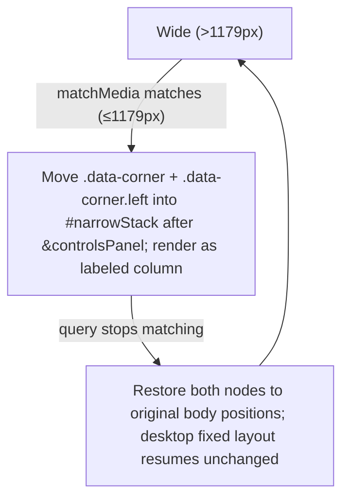
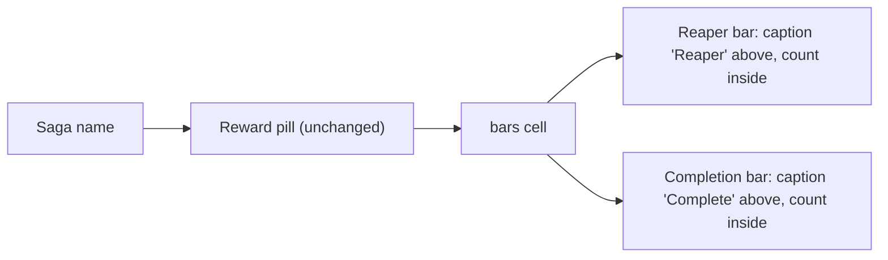

# Responsive Stacking & Header Twin-Bars - Plan

## Goal Capsule

- **Objective:** Make the scroll's narrow-window layout coherent, and replace each container header's First-Time Reaper badge + single progress bar with two captioned bars (reaper progress + completion) — while removing the low-value global summary band. Presentation-only.
- **Product authority:** Eddie (project owner) — all shape decisions confirmed in the brainstorm dialogue.
- **Open blockers:** None. No schema change; all bars derive from existing persisted state.
- **Target file:** `sooks-saga-scroll-07142026-2.html` is the live build; edits land in a new copy-first stamped build (see U1). Paths below are relative to the project root `personal/sooks-saga-scroll/`.

---

## Product Contract

*Product Contract preservation: unchanged from the requirements-only version. `ce-plan` added the Planning Contract and below; it did not alter any R-ID or product scope.*

### Summary

Collapse the app's narrow-width layout (≤~1179px) into one coherent, labeled priority column instead of today's scrambled wrapping rows, and give every saga and non-saga header two equal side-by-side bars — First-Time Reaper progress and general completion — in place of the old FTR badge and lone bar. Remove the global summary band. No new data is tracked; schema stays v14.

### Problem Frame

Two friction points drive this, both surfaced from real use of the live build (`sooks-saga-scroll-07142026-2.html`).

When the window narrows past the ~1179px breakpoint, the two fixed corner clusters go static and become independent centered wrapping rows, while the Filters panel floats separately in the document flow. Nothing enforces an order, so the character picker, LFM alerts, online-players, and guild indicators reflow into an incoherent jumble — the user reads it as "scrambled." There is no grouping to keep related indicators together.

In each container header, the saga-wide First-Time Reaper state is a two-state display badge, and a single progress bar tracks quest completion. The header also feeds a global summary band (Sagas Complete / Heroic-Epic-Legendary / Rewards Banked) whose aggregate numbers the user judges low-value. The reaper state would communicate progress better as a bar, sitting alongside a re-themed completion bar.

### Key Decisions

- **Priority stack for the narrow layout** (session-settled: user-directed — chosen over a two-group boxed layout and a minimal keep-clusters-in-place reorder: it gives the single most coherent, predictable order).
- **Caption-above bar treatment** (session-settled: user-directed — chosen over icon-only and caption-below: clearest labeling, count never competes with a word inside the bar).
- **Completion bar keeps its existing metric** (session-settled: user-approved — chosen over broadening what it counts: pure re-theme, so no schema bump and the import/export contract stays intact).
- **Presentation-only; schema stays v14** (session-settled: user-approved). Both bars read from data that already exists — reaper-marked quests and the saga-done map.
- **Global summary band is removed, not relocated** (session-settled: user-directed). Those aggregate stats leave the UI entirely.
- **Twin bars apply to non-saga containers too**, and a container with zero reaper-eligible quests shows a muted `0/0` reaper bar (session-settled: user-approved default over hiding it).

### Requirements

**Narrow-window responsive layout**

- R1. When the viewport is ≤~1179px, the fixed corner clusters and the Filters panel reflow into a single centered priority column ordered: Filters & Alerts → Characters → Group Alerts (LFM: Low, Mid, High, Raid) → Server (Online Players, Guild).
- R2. Each logical group in that column carries a section label so groups remain visually distinct and never interleave.
- R3. The Filters & Alerts panel stays intact as one grouped unit and keeps its existing fold control.
- R4. The character picker separates from the LFM panels it currently shares a cluster with, so it sits above them per the R1 order.
- R5. Wide layout (>1179px) is unchanged: the fixed corner clusters keep their current positions and behavior.

**Header twin bars**

- R6. Each saga and non-saga container header shows two progress bars side by side at the far right, equal width, each with a caption above and its count inside; the caption and count must not overflow the bar at any realistic count (including three-digit totals).
- R7. The left bar is First-Time Reaper progress — fill = reaper-completed quests ÷ reaper-eligible quests (excluding `NO_REAPER` quests) — and it advances only when a quest is completed in reaper, never on a non-reaper completion.
- R8. The right bar is general completion — fill = the existing saga-done count ÷ total (unchanged metric) — re-themed and captioned as completion.
- R9. The two bars replace the former First-Time Reaper badge and the single progress bar in the header.
- R10. A container with zero reaper-eligible quests renders the reaper bar in a muted state showing `0/0`; the completion bar still renders normally.

**Removal**

- R11. Remove the global summary band (Sagas Complete / Heroic-Epic-Legendary / Rewards Banked) entirely; those aggregates no longer appear anywhere in the UI.

**Data contract**

- R12. No change to the persisted schema (stays v14) or the import/export contract. All bar values derive from existing state.

### Acceptance Examples

- AE1. Reaper advances only on reaper completion. **Covers R7.**
  - **Given** a container with 10 reaper-eligible quests, 4 already marked reaper.
  - **When** a 5th quest is completed in reaper — **Then** the reaper bar reads 5/10.
  - **When** a quest is instead completed non-reaper (green seal only) — **Then** the reaper bar is unchanged.
- AE2. Zero reaper-eligible container. **Covers R6, R10.**
  - **Given** a container whose quests are all `NO_REAPER`.
  - **Then** the reaper bar renders muted showing 0/0, and the completion bar renders normally.
- AE3. Narrow reflow order. **Covers R1, R2, R4.**
  - **Given** the viewport is ≤~1179px.
  - **Then** the page is a single centered column ordered Filters → Characters → LFM → Server, each group labeled, with no cluster interleaving.
- AE4. Wide layout preserved. **Covers R5.**
  - **Given** the viewport is >1179px.
  - **Then** the corner clusters remain fixed exactly as today.
- AE5. Text never spills. **Covers R6.**
  - **Given** a container with a three-digit total (e.g. 128/128).
  - **Then** both bars' captions and counts fit without overflowing the bar width.

### Scope Boundaries

- The global summary band is removed, not moved to another location.
- The desktop / wide-window fixed-corner arrangement is untouched.
- No new metrics or counters; reward-banked tracking is unchanged.
- The Filters panel's internal contents are unchanged — only its position within the narrow-width stack changes.

---

## Planning Contract

### Key Technical Decisions

- KTD1. **Narrow reflow by `matchMedia` reparent, not static DOM move** (session-settled: user-directed — chosen over a no-JS static relocation: guarantees the out-of-scope desktop layout stays byte-identical even if an ancestor establishes a containing block via `transform`/`filter`). A `matchMedia('(max-width: 1179px)')` listener moves `.data-corner` and `.data-corner.left` into a new `#narrowStack` wrapper inserted immediately after `#controlsPanel` when the query matches, and restores both nodes to their original `<body>` positions when it stops matching. Nodes are *moved*, never recreated, so live-refresh bindings and fold state survive. Instantiates Key Decision "Priority stack for the narrow layout."
- KTD2. **Twin bars as one right-aligned flex cell** (session-settled: user-directed, 2A). Collapse the `.saga-header` grid's FTR-badge column and progress-bar column into a single flex `bars` cell holding two equal-width `.barwrap` children (caption above, bar below, count inside). Reuse `.saga-progress-bar` / `.saga-progress-fill` for the completion bar; add a `.saga-reaper-bar` variant reusing the `.ftr-badge` reaper palette. Overflow guard: bars `min-width: 0`, count text `overflow: hidden`. Instantiates Key Decision "Caption-above bar treatment."
- KTD3. **Completion metric unchanged** (session-settled: user-approved). Reaper fill = `reaperDone / reaperEligibleTotal`; completion fill = `st.done / st.total` — both already produced by `sagaStatus()`. No new state, `SCHEMA_VERSION` stays 14. Instantiates Key Decisions "Completion bar keeps its existing metric" and "Presentation-only."
- KTD4. **Zero-reaper containers** (session-settled: user-approved). When `reaperEligibleTotal === 0`, add a `muted` modifier and render `0/0`; the completion bar renders normally.
- KTD5. **Copy-first build** (garage park-retention convention). Copy the live build to a new date-stamped filename before any edit; all edits target the copy; the parked build is never edited in place. Apply 3-build retention after the final build.
- KTD6. **Band removal + dead-code cleanup** (session-settled: user-directed for removal; cleanup mechanics at execution). Remove the `#progressBand` element and the `renderProgress()` call, then delete `renderProgress()`. Grep `charSummary()` for other references before deleting it — remove only if unused elsewhere.

### High-Level Technical Design

Narrow-reflow reparent lifecycle (KTD1):

Header composition after the change (KTD2):

### Assumptions

- Non-saga containers render through the same `renderSagaCard()` header path as sagas, so twin bars apply to both without a separate code path.
- `sagaStatus()` already exposes `reaperDone` and `reaperEligibleTotal` (or `ftrRemaining` from which they derive) for every container, saga and non-saga.
- No ancestor of `<body>` establishes a containing block for fixed positioning; U3 verifies this before relying on the restore-to-body behavior.

### Sequencing

U1 first (creates the working build all other units edit). U2, U3, U4 are independent of each other and can land in any order on top of U1.

---

## Implementation Units

### U1. Create the working build (copy-first) and stamp version

- **Goal:** Produce the new date-stamped build from the live build so every subsequent edit targets the copy, per garage park-retention.
- **Requirements:** enables R1–R12; R12 (schema unchanged).
- **Dependencies:** none.
- **Files:** copy `sooks-saga-scroll-07142026-2.html` → `sooks-saga-scroll-07182026-1.html` (new working build; roll the trailing iteration if a 07182026 build already exists).
- **Approach:** Copy first — never edit the parked build. Update the in-file build-stamp marker; leave `SCHEMA_VERSION` at 14. Park retention (keep 2 most recent overall + the previous day's last build as cross-day anchor) is applied after the final build, not now.
- **Test expectation:** none (mechanical) — `node --check` passes on the new file and it opens offline.
- **Verification:** new stamped file exists, opens in a browser, build stamp reflects the new date/iteration.

### U2. Header twin bars (reaper + completion)

- **Goal:** Replace the FTR badge + single progress bar with two equal side-by-side bars — reaper progress and completion — caption above, count inside, overflow-safe.
- **Requirements:** R6, R7, R8, R9, R10. Cites KTD2, KTD3, KTD4.
- **Dependencies:** U1.
- **Files:** the new build — `.saga-header` grid CSS (~1157), `.ftr-badge` / `.saga-progress-bar` CSS (~1214, ~1435), `renderSagaCard()` header markup (~14029–14093).
- **Approach:** In `renderSagaCard()`, drop the `ftrBadge` span and build a `bars` flex cell with two `.barwrap` children. Completion bar reuses `.saga-progress-bar` mechanics (`st.done`/`st.total`). Reaper bar is a `.saga-reaper-bar` variant filled from `reaperDone`/`reaperEligibleTotal` in the reaper palette. When `reaperEligibleTotal === 0`, add `muted` and show `0/0`. Collapse the two right-hand header grid columns into the single `bars` cell; guard overflow (`min-width:0` on bars, `overflow:hidden` on the count text).
- **Patterns to follow:** mirror the existing `.saga-progress-fill` width computation and the `.ftr-badge.sealed` reaper coloring.
- **Test scenarios:**
  - Covers AE1: 4→5 reaper on a reaper completion; unchanged on a non-reaper (green-seal) completion.
  - Covers AE2 / R10: all-`NO_REAPER` container renders muted `0/0` reaper bar; completion bar normal.
  - Covers AE5 / R6: a `128/128` container fits both captions and counts with no overflow.
  - Completion bar value equals the pre-change `st.done / st.total` (no regression).
  - Both bars render equal width, right-aligned, on a saga *and* a non-saga container header.
- **Execution note:** verify in a real browser (offline-forced); confirm the reaper bar moves only on reaper completions.
- **Verification:** visual pass; reaper and completion values correct on at least one saga and one non-saga container.

### U3. Narrow-width priority-stack reflow

- **Goal:** At ≤1179px, present one centered labeled column ordered Filters → Characters → LFM → Server; desktop unchanged.
- **Requirements:** R1, R2, R3, R4, R5. Cites KTD1.
- **Dependencies:** U1.
- **Files:** the new build — insert `#narrowStack` anchor after `#controlsPanel` (~3919); add a `matchMedia` handler in the script; narrow-width CSS in the `@media (max-width:1179px)` block (~3779) plus a new Server group label.
- **Approach:** Add a `matchMedia('(max-width: 1179px)')` listener (fire once on load, then on change). On match: move `.data-corner` then `.data-corner.left` into `#narrowStack`. On unmatch: restore both to their original body positions. Style `#narrowStack` as a column; each cluster becomes a vertical labeled group reusing its existing `.corner-cap` labels (add a "Server" cap over the pop+guild group). Within the right cluster the Characters card already precedes the LFM cards (R4); pop already precedes guild. Filters keeps its own grouped card with the fold control intact (R3). Confirm no transformed `<body>` ancestor before relying on restore-to-body (see Assumptions).
- **Patterns to follow:** reuse existing `.corner-cap` label styling and the current ≤1179px static rules, adapted from wrapping rows to a column.
- **Test scenarios:**
  - Covers AE3 / R1, R2: at ~1100px the page is one column ordered Filters → Characters → LFM → Server, each group labeled, no interleave.
  - Covers AE4 / R5: at ~1400px the corner clusters are fixed exactly as before (no visual delta).
  - Resize across the 1179px boundary in both directions restores the layout correctly; live-refresh still updates cluster contents after a reparent.
  - Filters fold control still toggles when narrow (R3).
- **Execution note:** verify offline in a real browser at ~1400, ~1100, ~600, ~460px; confirm cluster bindings and live-refresh survive the reparent.
- **Verification:** visual pass at multiple widths; no console errors; live refresh intact after reflow.

### U4. Remove global summary band + dead-code cleanup

- **Goal:** Remove the `#progressBand` band and delete its now-dead render code.
- **Requirements:** R11. Cites KTD6.
- **Dependencies:** U1.
- **Files:** the new build — `#progressBand` element (~3899), `renderProgress()` (~13788) and its call sites, `charSummary()` (~12288).
- **Approach:** Remove the `#progressBand` element and the `renderProgress()` call(s), then delete `renderProgress()`. Grep `charSummary()` for other references; delete only if unused elsewhere. Confirm nothing else reads `#progressBand`.
- **Test expectation:** none (removal) — `node --check` passes, no console errors, band absent, the rest of the UI intact.
- **Verification:** band gone; app loads clean with no console errors.

---

## Verification Contract

| Check | Applies to | Done signal |
|---|---|---|
| `node --check` syntax pass | U1, U2, U3, U4 | Exits clean on the new build |
| Real-browser offline-forced visual pass | U2, U3, U4 | All 5 Acceptance Examples hold; zero console errors |
| Resize across 1179px boundary (both directions) | U3 | Reflow + restore correct; live-refresh intact |
| Reaper/completion value spot-check on saga + non-saga | U2 | Bars match `sagaStatus()` values; reaper moves only on reaper |

---

## Definition of Done

- R1–R12 satisfied; all 5 Acceptance Examples pass in a real browser (offline-forced).
- Desktop (>1179px) layout is visually unchanged from `sooks-saga-scroll-07142026-2.html`.
- `SCHEMA_VERSION` remains 14; a whole-state Export → Import round-trips unchanged.
- No console errors on load or during resize/reflow.
- The new stamped build is parked with 3-build retention (2 most recent + previous-day cross-day anchor); the parked prior build is untouched.
