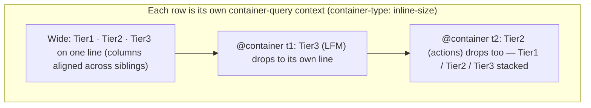

# Uniform Roll-Over Row Stacking - Plan

## Goal Capsule

- **Objective:** Give the saga container headers and the quest rows one uniform, progressive tier-stacking system as they narrow, with aligned item heights within a row and aligned action columns across rows; decouple the LFM info from the progress bar; and make the reaper bar shiny like the completion bar. Presentation-only.
- **Product authority:** Eddie (project owner) — shape decisions confirmed via a visual probe; alignment requirements (R9, R10) added by the user during planning.
- **Open blockers:** None. No schema change.
- **Target file:** live build `sooks-saga-scroll-07182026-2.html`; edits land in a new copy-first stamped build. Paths are relative to the project root `personal/sooks-saga-scroll/`.

---

## Product Contract

*Product Contract preservation: changed — added R9 (intra-row height alignment) and R10 (inter-row column alignment) at the user's direction during planning. R1–R8 unchanged.*

### Summary

Replace the current ragged per-element wrapping in the saga container headers and quest rows with one uniform, progressive **tier** system: as a row runs low on width, whole tiers roll to the next line in priority order — Tier 1 (name + level) stays on top, Tier 2 (the actions group) rolls next, Tier 3 (LFM) rolls first and lowest. Each tier rolls atomically. Items within a row share a consistent height, and the action groups align in vertical columns across sibling rows. Alongside: the LFM becomes its own tier instead of riding under the progress bar, and the reaper bar gains the completion bar's shiny gold treatment. No data or schema change.

### Problem Frame

After the 07182026.2 responsive work, the container header still falls into a ragged `flex-wrap` at its narrow breakpoint, and quest rows wrap their name, giver, and controls unevenly — elements wrap one at a time, so a single bar or button can strand on its own line and the layout reads as cluttered rather than composed. Items within a row don't share a clean vertical rhythm, and the action groups don't line up from one row to the next, so the eye can't track a column down the page. The live LFM tag is visually welded under the completion bar, coupling two unrelated pieces of information. And the reaper bar looks flat and dull next to the completion bar's gold-trimmed shine, understating equally important progress.

### Key Decisions

- **One uniform tier model across both components** (session-settled: user-directed). Container headers and quest rows share the same three-tier priority and the same roll discipline, even though their Tier-2 contents differ.
- **Quest rows use B1 — name on top, controls roll below** (session-settled: user-directed — chosen over B2 "controls stay left": full uniformity with the container, accepting that the completion controls move from left-of-name when wide to below-name when narrow).
- **Progressive rolling, LFM first** (session-settled: user-directed — chosen over a single all-at-once breakpoint: matches the name → actions → LFM priority and gives a clean medium state).
- **Each component rolls on its own available width** (session-settled: user-approved). A container header and a quest row may sit at different tier states at the same viewport; each rolls only when its own content needs to.
- **LFM decoupled from the progress bar** (session-settled: user-directed). LFM is its own Tier-3 element, not nested in the bar column.
- **Shiny reaper bar** (session-settled: user-directed). The reaper bar gets the completion bar's gold trim, glow, and sheen while keeping its wax-red fill identity.

### Requirements

**Tier model (both components)**

- R1. Both the saga container headers and the quest rows use one uniform stacking model with three priority tiers: Tier 1 = name + level; Tier 2 = the actions group (container header: banked/reward pill + reaper bar + completion bar; quest row: the completion controls — the master checkbox plus the Reaper, Complete, and Skip buttons); Tier 3 = LFM information.
- R2. Tiers roll progressively as available width shrinks: Tier 3 (LFM) rolls to its own line first, then Tier 2 rolls to its own line; Tier 1 always stays on the top line.
- R3. Each tier rolls as one atomic group — a tier never fragments, so a lone bar, button, or pill never wraps by itself.
- R4. Each component rolls based on its own available width, not a single global screen width — the container header type and the quest-row type may be at different tier states at the same viewport, and each still reads clean.

**Quest row (B1)**

- R5. A wide-enough quest row keeps today's inline arrangement (toggle, completion controls, then name · shared · giver · level, with LFM). As it narrows it adopts the tier stack: name + level on top, the completion controls below as a group, then LFM.

**LFM decoupling**

- R6. LFM information renders as its own Tier-3 element, no longer nested inside or beneath the progress-bar column of the container header.

**Shiny reaper bar**

- R7. The reaper progress bar carries the same shiny treatment as the completion bar — gold-trimmed border, glow, and animated sheen (behind `prefers-reduced-motion`) — while keeping its wax-red fill so it still reads as the reaper bar.

**Alignment**

- R8. Presentation-only: no persisted-schema change (stays v14), and no change to what any tier's contents mean or compute.
- R9. Within any single row (container header or quest row), the items on a line share a consistent height and vertical alignment — buttons, bars, pills, level chip, and name sit on one clean baseline, none ragged.
- R10. Across sibling rows of the same type — saga header to saga header, quest row to quest row — the Tier-2 action group aligns in vertical columns top-to-bottom at non-stacked widths: the reward pill and the two bars line up across saga cards, and the checkbox plus control buttons line up across quest rows. Alignment holds as the tier state changes because same-type siblings share width and roll in lockstep.

### Acceptance Examples

- AE1. Container progressive roll. **Covers R1, R2.**
  - **Given** a saga container header narrowing from wide to narrow.
  - **Then** it passes through: one row → LFM on its own line → name+level / pill+bars / LFM.
- AE2. Atomic tier. **Covers R3.**
  - **Given** the width where the two bars no longer fit beside the name.
  - **Then** the whole Tier 2 (pill + reaper bar + completion bar) drops together; a single bar never wraps alone.
- AE3. Quest-row B1 stack. **Covers R5.**
  - **Given** a narrow quest row.
  - **Then** name + level sit on top, the Reaper/Complete/Skip controls sit below as a group, and LFM sits below that.
- AE4. Per-type independence. **Covers R4.**
  - **Given** a viewport where a container header is still one row but a wider quest row has already rolled its controls.
  - **Then** both read clean — neither is forced to roll or stay by the other.
- AE5. Shiny reaper. **Covers R7.**
  - **Given** a reaper bar with progress.
  - **Then** it shows gold trim + glow + sheen like the completion bar, still wax-red filled.
- AE6. LFM decoupled. **Covers R6.**
  - **Given** any container header.
  - **Then** the LFM element is a standalone tier, not positioned inside the completion-bar column.
- AE7. Column alignment. **Covers R10.**
  - **Given** several saga cards (and, in an expanded saga, several quest rows) at a non-stacked width.
  - **Then** the reward pill and both bars form straight vertical columns down the saga cards, and the checkbox + control buttons form straight columns down the quest rows — no ragged left/right offsets between siblings.
- AE8. Height alignment. **Covers R9.**
  - **Given** any single row with mixed items (name, level chip, pill, bars, or buttons).
  - **Then** those items share one vertical center line; none sits high or low relative to its neighbors.

### Scope Boundaries

- No change to what any tier's contents mean or compute (reaper/completion metrics, control behavior, LFM matching all unchanged).
- The ≤1179px corner-cluster reparent from build 07182026.2 is not being reworked — the new tier system must coexist with it cleanly, not replace it.
- No new controls, bars, or data are added.

---

## Planning Contract

### Key Technical Decisions

- KTD1. **Per-component rolling via CSS container queries** (session-settled: user-approved for per-component width; mechanism chosen over faked shared media breakpoints). Each container header and each quest row becomes its own query container (`container-type: inline-size` on the row, or a thin wrapper); the tier drops are `@container (max-width: …)` rules, so every row rolls on its own measured width. Same-type siblings share width, so they roll in lockstep — which is exactly what preserves column alignment (KTD5). Container queries are supported in the modern Chromium the app is used and verified in; a tuned shared-media-breakpoint fallback is a deferred option only if a target browser ever lacks support.
- KTD2. **Tiers are flex rows inside a flex column; wrapping is at the tier level, never per element** (session-settled: uniform model + atomic tiers). Restructure `.saga-header` and `.quest` so each holds up to three tier rows (Tier 1 / Tier 2 / Tier 3); each tier is a nowrap flex row that stays intact. The container query toggles how many tiers sit on one line vs. their own line — individual elements never `flex-wrap`.
- KTD3. **Two progressive container-query thresholds per component** (session-settled: progressive). The first threshold drops Tier 3 (LFM) to its own line; the second drops Tier 2. Exact px thresholds are tuned per component during implementation against real content widths.
- KTD4. **Quest row B1 restructure** (session-settled: user-directed — over B2). Reorder so Tier 1 = name + level, Tier 2 = the completion-controls cluster, Tier 3 = LFM (the existing `.quest-live` line). At the widest state the row still reads controls-then-name inline; as it narrows, name rises to Tier 1 and controls drop to Tier 2.
- KTD5. **Column alignment via fixed action-column geometry** (implements R10). Container headers keep a grid whose action columns are fixed-width so the reward pill and the two equal-width bars align across cards — give the reward pill a fixed/min width so the bars start at the same offset on every card. Quest rows keep the completion controls as a fixed-width left cluster (the buttons already share a locked 140px footprint) so they column-align across rows. Because same-type siblings roll together (KTD1), the columns stay aligned in every tier state.
- KTD6. **Intra-row height alignment** (implements R9). Every tier row uses center cross-axis alignment and consistent element heights (bars, pills, level chip, and buttons share a common row height), so items never sit ragged on a line.
- KTD7. **Decouple LFM into its own Tier-3 element** (session-settled). Move the container header's LFM tag out of the completion `.saga-barwrap` and render it as a standalone Tier-3 element; the quest row's `.quest-live` line already is its Tier 3.
- KTD8. **Shiny reaper bar** (session-settled). Add a reaper variant of the completion bar's `has-progress` treatment — gold border, glow, and the `::after` sheen (behind `prefers-reduced-motion`) — layered over the wax-red fill so it reads as reaper + shiny, not green.
- KTD9. **Copy-first build; presentation-only** (garage convention). Copy the live build before editing; `SCHEMA_VERSION` stays 14; no change to any compute path.

### High-Level Technical Design

Per-component progressive rolling — the same shape drives both the header and the quest row; only Tier-2 contents differ:

Tier composition per component:

| Tier | Container header | Quest row |
|---|---|---|
| Tier 1 | name + level | name + level |
| Tier 2 | reward pill + reaper bar + completion bar | checkbox + Reaper + Complete + Skip buttons |
| Tier 3 | LFM element (decoupled) | LFM live line (existing) |

---

## Implementation Units

### U1. Create the working build (copy-first) and stamp version

- **Goal:** Produce the new date-stamped build so all edits target the copy, per garage park-retention.
- **Requirements:** enables R1–R10; R8 (schema unchanged). Cites KTD9.
- **Dependencies:** none.
- **Files:** copy `sooks-saga-scroll-07182026-2.html` → `sooks-saga-scroll-07182026-3.html` (roll the trailing iteration if a 07182026-3 already exists).
- **Approach:** Copy first; never edit the parked build. Bump the in-file build stamp; leave `SCHEMA_VERSION` at 14. Park retention runs after the final build.
- **Test expectation:** none (mechanical) — `jsc` syntax pass; file opens offline.
- **Verification:** new stamped file exists and opens; build stamp updated.

### U2. Container header — tier restructure, container-query rolling, decoupled LFM, aligned columns

- **Goal:** Rebuild the saga container header as the 3-tier model that rolls progressively on its own width, with the LFM decoupled into Tier 3, action columns aligned across cards, and items height-aligned within each tier.
- **Requirements:** R1, R2, R3, R4, R6, R9, R10. Cites KTD1, KTD2, KTD3, KTD5, KTD6, KTD7.
- **Dependencies:** U1.
- **Files:** the new build — `.saga-header` grid + `.saga-bars`/`.saga-barwrap` CSS (~1157, ~1214, ~1241); `renderSagaCard` header markup (~14073–14100); the ≤820px / ≤700px header media rules (~3706, ~3720).
- **Approach:** Make the header a query container. At the widest state keep a grid so Tier-1 (name, level) and Tier-2 (pill, reaper bar, completion bar) sit on one line with the action columns fixed-width and aligned across cards (give the reward pill a fixed/min width; bars stay equal 118px). Move the LFM tag out of the completion `.saga-barwrap` into a standalone Tier-3 element. Add two `@container` thresholds: first drops the LFM element to its own line, second drops the whole Tier-2 group. Each tier is a nowrap, center-aligned flex row (R9). Retire the ragged ≤700px flex-wrap header rule (superseded by the tier system); keep or fold the ≤820px rule as needed.
- **Execution note:** verify in a real browser (offline) at several widths; confirm sibling cards roll together and columns stay aligned.
- **Patterns to follow:** reuse the existing `.saga-bars`/`.saga-barwrap` structure and the `.reward-pill` styling; mirror the equal-width bar approach already in place.
- **Test scenarios:**
  - Covers AE1: header rolls wide → LFM-dropped → fully stacked as width shrinks.
  - Covers AE2 / R3: at the Tier-2 threshold the pill + both bars drop together; no lone bar wraps.
  - Covers AE6 / R6: the LFM element is a sibling tier, not inside the completion bar column.
  - Covers AE7 / R10: reward pill + bars form straight vertical columns across at least three stacked saga cards at a non-stacked width.
  - Covers AE8 / R9: name, level chip, pill, and bars share one vertical center line.
  - Non-saga container header renders the same tier structure.
- **Verification:** visual pass at multiple widths; columns aligned across cards; no console errors.

### U3. Shiny reaper bar

- **Goal:** Give the reaper bar the completion bar's shiny treatment while keeping its red fill.
- **Requirements:** R7. Cites KTD8.
- **Dependencies:** U1.
- **Files:** the new build — `.saga-progress-bar.reaper` and `.saga-progress-bar.has-progress` CSS (~1238–1269).
- **Approach:** Add a reaper `has-progress` variant that applies the gold border, glow, and `.saga-progress-fill::after` sheen (behind `prefers-reduced-motion`) over the wax-red fill — reusing the completion bar's shine rules, overriding only the fill color so it stays reaper-red.
- **Patterns to follow:** the existing `.saga-progress-bar.has-progress` gold/glow/sheen block.
- **Test scenarios:**
  - Covers AE5 / R7: a reaper bar with progress shows gold trim + glow + sheen, fill still red.
  - A zero-progress (or muted 0/0) reaper bar stays quiet — no gold glow.
  - `prefers-reduced-motion` suppresses the sheen animation.
- **Verification:** visual pass; reaper bar reads shiny-red, not green; reduced-motion respected.

### U4. Quest row — B1 tier restructure, container-query rolling, aligned control columns

- **Goal:** Rebuild the quest row as the B1 3-tier model that rolls progressively on its own width, with the control cluster column-aligned across rows and items height-aligned within each tier.
- **Requirements:** R1, R2, R3, R4, R5, R9, R10. Cites KTD1, KTD2, KTD3, KTD4, KTD5, KTD6.
- **Dependencies:** U1.
- **Files:** the new build — `.quest` / `.quest-main` / `.quest-line1` / `.quest-live` CSS (~2095–2149); `renderQuestRow` markup (~14693, return block ~14924).
- **Approach:** Make the quest row (or a thin wrapper) a query container. Restructure into tiers: Tier 1 = toggle + name + level (+ shared/giver where they fit), Tier 2 = the completion-controls cluster (checkbox + Reaper + Complete + Skip; counts vary — NO_REAPER omits Reaper, non-saga omits Skip), Tier 3 = the existing `.quest-live` LFM line. Keep the controls a fixed-width left cluster at the widest state so they column-align across rows (buttons already share a 140px footprint). Add two `@container` thresholds mirroring U2: LFM drops first, then the controls drop below the name (B1). Each tier is a nowrap, center-aligned flex row (R9). Handle the wide→narrow reflow where controls move from left-of-name to below-name so the transition isn't jarring.
- **Execution note:** verify at several widths; confirm control buttons column-align across sibling quest rows and that variable control counts (2 vs 3 buttons) still align cleanly.
- **Patterns to follow:** the existing `.quest-main` two-line column and `.quest-live` line; mirror U2's tier + container-query structure so the two components read as one system.
- **Test scenarios:**
  - Covers AE3 / R5: narrow quest row shows name+level on top, controls below as a group, LFM below.
  - Covers AE1 / R2: quest row rolls progressively (LFM first, then controls).
  - Covers AE7 / R10: checkbox + control buttons form straight columns across several quest rows at a non-stacked width.
  - Covers AE8 / R9: toggle, name, level chip, and buttons share one center line.
  - A NO_REAPER quest (no Reaper button) and a non-saga quest (no Skip button) still align and stack cleanly.
- **Verification:** visual pass at multiple widths; control columns aligned across rows; no console errors.

### U5. Reconcile breakpoints and retire superseded rules

- **Goal:** Ensure the new per-component tier system coexists cleanly with the existing viewport breakpoints and that no dead/ragged rules remain.
- **Requirements:** R4. Cites KTD1.
- **Dependencies:** U2, U4.
- **Files:** the new build — remaining header/row media rules (~3706, ~3720) and the `#narrowStack` matchMedia reparent block (search `initNarrowStack`).
- **Approach:** Remove or neutralize the superseded ragged flex-wrap rules the tier system replaces. Confirm the ≤1179px corner-cluster reparent still fires and looks correct alongside the tiered headers/rows (the reparent moves the corner clusters, not the saga list — they should not interact, but verify). Confirm container-query rolling and any remaining viewport media rules don't fight (e.g. double-stacking).
- **Test expectation:** none new beyond U2/U4 scenarios — this is reconciliation/cleanup. `jsc` syntax pass; no console errors.
- **Verification:** at ~1400 / ~1100 / ~700 / ~460px the headers, quest rows, and the corner-cluster reparent all render clean with no conflicting stacking.

---

## Verification Contract

| Check | Applies to | Done signal |
|---|---|---|
| `jsc` syntax pass (extract `<script>`, `new Function(src)`) | U1–U5 | Prints `SYNTAX_OK` |
| Real-browser offline visual pass at multiple widths | U2, U3, U4, U5 | AE1–AE8 hold; zero console errors |
| Column-alignment check across ≥3 sibling cards / rows | U2, U4 | Pill/bars and control buttons form straight vertical columns |
| Reduced-motion check | U3 | Reaper sheen animation suppressed under `prefers-reduced-motion` |
| Coexistence with ≤1179px reparent | U5 | Corner-cluster reparent still fires; no double-stacking |

---

## Definition of Done

- R1–R10 satisfied; all 8 Acceptance Examples pass in a real browser (offline).
- Both container headers and quest rows roll through the three tier states progressively and atomically on their own width; same-type siblings roll in lockstep with aligned columns.
- The reaper bar reads shiny-red like the completion bar; reduced-motion respected.
- LFM is a standalone tier on the container header; the quest `.quest-live` line is its Tier 3.
- Items within every row share one height/baseline; action groups column-align across sibling rows.
- `SCHEMA_VERSION` remains 14; a whole-state Export → Import round-trips unchanged; no console errors on load or resize.
- The ≤1179px corner-cluster reparent still works alongside the new system.
- The new stamped build is parked with 3-build retention; the prior build is untouched.
