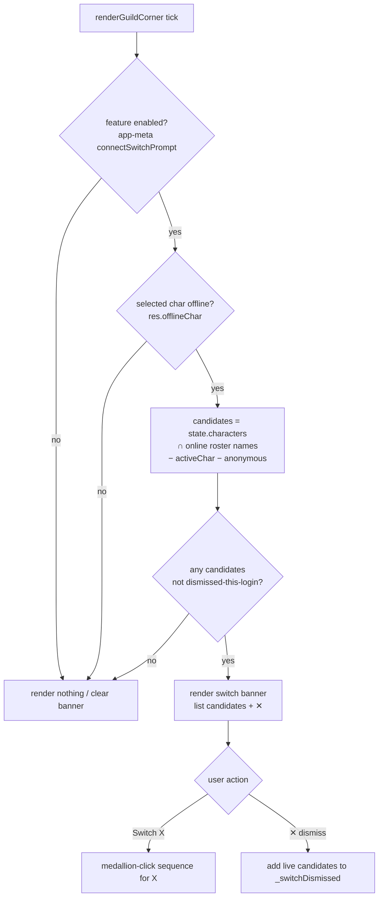

# Connect-Switch Prompt - Plan

**Target file:** `sooks-saga-scroll-<MMDDYYYY>-<N>.html` (single-file app; current build `sooks-saga-scroll-07252026-1.html`). All edits land in that one file. Follow the copy-first build workflow (copy current build to the next build filename, edit only the copy, stamp the footer version).

**Product Contract preservation:** Product Contract unchanged — R1–R10, Key Decisions, and Scope Boundaries carried forward verbatim from the requirements-only artifact. Planning added the Planning Contract, Implementation Units, Verification Contract, and Definition of Done below.

---

## Goal Capsule

- **Objective:** When the player logs onto a different character than the one currently selected in Sook's Saga Scroll, offer to switch the scroll to that character — dismissible, low-CPU, reusing the existing 15s live poll.
- **Product authority:** Project owner (Sook's Saga Scroll).
- **Open blockers:** None. KD6 feasibility (guild roster reachable while selected char offline) is confirmed by inspection — `renderGuildCorner` already calls `fetchCharacter(server, active)` and uses `res.data.guild_name` regardless of the character's online state; DDO Audit returns the character record with `{offlineChar:true, data}` for an offline character.

---

## Summary

A dismissible banner that appears when the selected character is offline and one or more of the player's own characters are online in the same guild roster the poll already fetches, offering to switch the scroll's active character to one of them. Reuses existing roster data and the `.loc-banner` UI — no new timers and no new network calls.

---

## Problem Frame

Players hop between characters in-game, but the scroll keeps whatever character was last selected via the medallion. Today the player must notice the mismatch and switch manually. The scroll already polls DDO Audit every 15s and already computes, per tick, (a) whether the selected character is online (`fetchCharacter` in `renderGuildCorner`) and (b) which guildmates are online (`fetchGuildmates` → `_summarizeGuild`). So "you're playing someone else" is detectable for free — the explicit constraint for this feature is that it must not add network/CPU load.

---

## Requirements

- **R1.** When the selected character is offline AND at least one of the player's own added characters appears online in the current guild roster, show a switch-offer banner.
- **R2.** Detection reuses the guild-roster data already fetched each 15s tick; it adds no network requests and no timers of its own.
- **R3.** Roster rows are matched to owned characters by name, case-insensitively. Anonymous-flagged rows (name blanked by DDO Audit) cannot match and are silently skipped.
- **R4.** Coverage is limited to owned characters in the same guild + server as the selected character. Cross-server / cross-guild detection is out of scope.
- **R5.** If more than one owned character is online, the banner lists them and the player picks which to switch to (no automatic pick).
- **R6.** Choosing a character switches the scroll to it by replicating the existing medallion-click sequence (reset live module state, set `state.activeChar`, re-theme, save, re-render).
- **R7.** The banner persists while its condition holds and disappears when: the player acts (switch or dismiss), the listed alt(s) log off, or the selected character comes back online. The listed set updates live as owned alts appear/disappear.
- **R8.** Dismiss ("No") silences the currently-listed alts for their current online session, re-offering only on a genuinely new login. In-memory, no persisted field, no schema change.
- **R9.** A global on/off toggle enables/disables the whole feature. Stored in the existing app-meta store, not in `state` — no schema bump. Defaults ON.
- **R10.** The feature honors the existing tick gates: it does no work when the tab is hidden (`document.hidden`) or the Manage panel is open (`charManageMode`).

---

## Key Technical Decisions

- **KTD1 — Reuse the guild roster for detection** *(session-settled: user-directed — chosen over per-character polling: zero added network/CPU; user explicitly prioritized keeping CPU load down).* Coverage limited to same guild + server, non-anonymous (R3, R4).
- **KTD2 — Trigger only when the selected char is offline** *(session-settled: user-directed — chosen over "whenever an owned alt is online": avoids nagging while deliberately on the selected char; intentionally suppresses dual-boxing).*
- **KTD3 — In-memory per-login dismiss** *(session-settled: user-directed — chosen over a persistent per-alt opt-out: no schema bump).* Reuses the established `_acSeen` continuous-stay dedupe pattern; `SCHEMA_VERSION` stays 14, `STORAGE_KEY` untouched.
- **KTD4 — Global toggle in app-meta, default ON** *(session-settled: user-approved).* Stored via `_readAppMeta`/`_writeAppMeta` like `controlsFolded`; the narrow trigger keeps default-ON safe.
- **KTD5 — Multi-candidate pick list** *(session-settled: user-directed — chosen over auto-picking one: no wrong guess).* Banner lists all owned online alts; player taps one.
- **KTD6 — Hook detection into `renderGuildCorner`, not a new tick path.** `renderGuildCorner` already runs each tick with both signals in hand (the `fetchCharacter` result revealing selected-char online state, and the `_summarizeGuild` online roster). Extending it adds no fetch and inherits the `document.hidden` / `charManageMode` gates that already guard `liveRefreshTick` (R2, R10).
- **KTD7 — Reuse the `.loc-banner` UI idiom** (inline action + ✕ dismiss), extended to render a multi-target list for R5, rather than building a new component.

---

## High-Level Technical Design

Per-tick decision, evaluated at the tail of `renderGuildCorner` (which already holds `res` from `fetchCharacter` and the `_summarizeGuild` online roster):

`_switchDismissed` entries are cleared for any owned character seen offline / absent from the roster, so a genuinely new login re-offers (R8).

---

## Implementation Units

### U1. Detection helper — owned online alts while selected offline

- **Goal:** Pure function that, given the active character, the `fetchCharacter` result, and the `_summarizeGuild` online roster, returns the list of owned characters to offer.
- **Requirements:** R1, R2, R3, R4.
- **Dependencies:** none.
- **Files:** `sooks-saga-scroll-<build>.html` (add helper near `renderGuildCorner` / `_summarizeGuild`).
- **Approach:** Return `[]` unless the active character is offline (`res.offlineChar === true`, i.e. not currently online). Otherwise intersect `state.characters` (lowercased) with the online roster names (`g.online[].name`, already self-excluded and anonymous-blanked by `_summarizeGuild`), drop the active char, and return the matching owned-character display names in `state.characters` order.
- **Patterns to follow:** name matching mirrors `_summarizeGuild`'s lowercase compare; read `state.characters` as the owned-character source of truth.
- **Test scenarios:**
  - Selected offline + one owned alt online in roster → returns `[alt]`.
  - Selected online (`res.offlineChar` falsy) → returns `[]` (Covers R1 trigger guard).
  - Owned alt present in roster but anonymous (name blank) → excluded (Covers R3).
  - Roster row online but not in `state.characters` → excluded.
  - Two owned alts online → returns both, in `state.characters` order (Covers R5).
  - Active char also appears in roster somehow → never included.
- **Verification:** helper returns expected arrays for the above states when exercised against synthetic `res` + roster inputs.

### U2. Feature toggle + per-login dismiss state

- **Goal:** Add the global on/off toggle (app-meta) and the in-memory per-login dismiss set.
- **Requirements:** R8, R9.
- **Dependencies:** none.
- **Files:** `sooks-saga-scroll-<build>.html` (app-meta accessor near `_readAppMeta`/`_writeAppMeta`; module-level `Set` near `_acSeen`).
- **Approach:** `connectSwitchEnabled()` reads `_readAppMeta().connectSwitchPrompt`, treating `undefined` as `true` (default ON, R9); a setter writes via `_writeAppMeta`. Add module-level `_switchDismissed = new Set()` keyed by lowercased owned-char name; a reconcile step (called each tick in U4) deletes entries for any owned char no longer online, so a new login re-offers (R8). No `state`/schema changes.
- **Patterns to follow:** `_readAppMeta`/`_writeAppMeta` usage as with `controlsFolded`; `_acSeen` lifecycle (add on handle, clear when condition absent).
- **Test scenarios:**
  - `connectSwitchEnabled()` returns `true` when meta unset (Covers R9 default).
  - Setting it `false` and reloading (meta persists) → still `false` (Covers R9 persistence).
  - Dismissing an alt adds it to `_switchDismissed`; reconcile removes it once that alt is offline/absent (Covers R8 re-offer on new login).
- **Verification:** toggle round-trips through app-meta; dismissed set clears correctly on reconcile.

### U3. Switch-offer banner + switch action

- **Goal:** Render the dismissible multi-candidate banner and wire the switch action.
- **Requirements:** R5, R6, R7.
- **Dependencies:** U1, U2.
- **Files:** `sooks-saga-scroll-<build>.html` (banner render adjacent to the existing `.loc-banner` render; reuse `.loc-banner` / `.lb-link` / `.lb-dismiss` CSS).
- **Approach:** Given candidates from U1, render a `.loc-banner`-styled element listing each candidate with a "Switch to X" control plus one ✕ dismiss. "Switch to X" replicates the medallion-click sequence exactly: reset `_nowPlaying`, `_locBannerDismissed`, `_lfmIndex`, `_lfmFetchKey`, `_lfmFetchTs`; set `state.activeChar = X`; `applyTheme(themeOf(X))`; `saveState()`; `renderAll()`. ✕ adds all currently-listed candidates to `_switchDismissed` (U2) and removes the banner. The banner is re-derived each tick (U4), so it clears automatically when the condition no longer holds (R7).
- **Patterns to follow:** `.loc-banner` structure (inline action button + `.lb-dismiss` ✕); the medallion click handler in `renderChars` for the exact switch sequence.
- **Test scenarios:**
  - Single candidate → banner shows "Switch to X?" with ✕ (Covers R7).
  - Click Switch → `state.activeChar` becomes X, theme + data re-render, banner gone (Covers R6).
  - Two candidates → both listed; picking one switches to that one only (Covers R5).
  - After switching to X, X is online (selected no longer offline) → next tick renders no banner (no re-offer loop).
  - ✕ dismiss → banner removed and listed alts added to `_switchDismissed` (Covers R8).
- **Verification:** manual in-browser drive (localhost + Claude-in-Chrome) — banner appears, Switch activates the character, ✕ dismisses.

### U4. Wire detection + banner into the live tick

- **Goal:** Invoke U1→U3 at the tail of `renderGuildCorner` each tick, with the dismiss reconcile.
- **Requirements:** R2, R7, R10.
- **Dependencies:** U1, U2, U3.
- **Files:** `sooks-saga-scroll-<build>.html` (`renderGuildCorner`).
- **Approach:** After the roster is summarized, run the dismiss reconcile (U2) against the current online owned set, compute candidates (U1), and render/clear the banner (U3) filtered by `connectSwitchEnabled()` and `_switchDismissed`. No new fetch or timer — reuses the `res` and roster already in scope. Inherits `liveRefreshTick`'s `document.hidden` / `charManageMode` gates (R10).
- **Patterns to follow:** `renderGuildCorner`'s existing stale-guard (`if (active !== state.activeChar) return;`) so a mid-fetch character switch doesn't render a stale banner.
- **Test scenarios:**
  - No added network requests versus baseline (detection reads already-fetched roster) (Covers R2).
  - Alt logs off between ticks → banner drops that candidate; last one leaving clears the banner (Covers R7).
  - Selected char comes back online → banner clears next tick (Covers R7).
  - Hidden tab → tick skipped, no banner work (Covers R10, inherited gate).
  - Feature toggled off → no banner regardless of candidates (Covers R9).
- **Verification:** in-browser drive across the state transitions above; confirm no per-tick network increase and self-check stays clean.

---

## Verification Contract

- Data self-check badge reads "No structural issues found"; 0 console errors after load.
- With the selected char offline and an owned alt online in-guild, the banner appears within one poll cycle (≤15s); choosing a character activates it (theme + data update).
- No increase in per-tick network requests versus the current build (detection reads already-fetched roster).
- Dismiss suppresses re-offer for the same login; a new login re-offers; after switching, no re-offer loop.
- `SCHEMA_VERSION` remains 14; `STORAGE_KEY` unchanged; Import/Export unaffected.
- Build lifecycle: copy-first to the next build filename, footer version stamped, retention applied.

---

## Scope Boundaries

- **Out:** per-character polling for cross-server/guild coverage (deferred; would add N fetches/tick).
- **Out:** a persistent per-alt "never ask" opt-out (only the global toggle + per-login dismiss).
- **Out:** detecting anonymous-flagged characters.
- **Out:** any schema/storage change — storage stays schema v14, key `sooksSagaScroll` unchanged.

### Deferred to Follow-Up Work

- A **visible** control for the master toggle (e.g., in the Filters & Alerts panel). U2 ships the app-meta flag (default ON) and the switch behavior; exposing a checkbox is a separate, optional follow-up (see Open Questions).

---

## Open Questions

- Exact banner placement (near the character medallions vs. top of the saga list vs. the existing `.loc-banner` slot). Resolve at implementation; does not change the detection contract.
- Whether the master toggle gets a visible control in v1 or ships meta-only first (deferred above).

---

## Definition of Done

- U1–U4 implemented in a single new build (copy-first, footer stamped, retention applied).
- Verification Contract met (self-check clean, banner behavior verified in-browser, no per-tick network increase).
- No schema change; Import/Export round-trips unchanged.
- README "Currently parked" + Files build note + Resume prompt updated for the new build.
