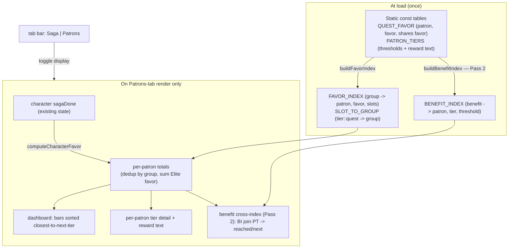

# Patron Favor Tracking & Reward Insight - Plan

**Product Contract preservation:** unchanged — planning added the Planning Contract, Key Technical
Decisions, High-Level Technical Design, Implementation Units, Performance Budget, Verification
Contract, and Definition of Done below without altering any product decision above.

## Goal Capsule

- **Objective:** Give Sook's Saga Scroll a character-level patron-favor view — computed live from
  each character's saga-seal completions — that shows how much favor each patron has, what the next
  tier unlocks, and lets the player chase a specific kind of bonus (e.g. +HP) across patrons.
- **Product authority:** User (project owner). Decisions below are session-settled.
- **Open blockers:** None product-side. The gating work is a wiki data harvest (see Product Contract
  §Data). Accuracy of harvested favor/patron/reward data is the primary risk.

## Product Contract

### Primary actor & outcome

- **Actor:** A DDO player tracking one or more characters in the app.
- **Outcome:** For the active character, see per-patron favor totals, tier progress, and the reward
  each tier unlocks — and cross-index rewards by benefit type to plan what to chase next.

### Navigation shell (settled)

The app adopts a **top-level two-tab shell**:

- **Saga tab** — the existing tracker exactly as it is today (all current container/quest/live-status
  content moves under this tab unchanged).
- **Patrons tab** — the new home for this entire favor capability (dashboard, per-patron detail,
  benefit-type cross-index). Nothing favor-related lives on the Saga tab.

Tab selection is app-global UI state (not per-character). The active character is shared across both
tabs — switching tabs never changes which character is active. Whether the persisted default tab
needs to survive reloads is a minor UI-preference question deferred to planning (see Storage note and
Outstanding Questions).

### What the feature does

All of the following lives on the **Patrons tab**. For the **active character**, derive patron favor
from completions and present it. Nothing is manually entered; nothing new is stored about the
player's favor — it is computed each render.

1. **All-patron favor dashboard.** One panel listing every patron the character has any favor with,
   as bars (current favor / next-tier threshold), sorted by closest-to-next-tier. The "home screen"
   of the feature.
2. **Per-patron tier detail.** For a chosen patron: its favor tiers, the current position, the next
   tier, and the **full reward text** granted at each tier.
3. **Benefit-type cross-index.** Pick a benefit type (e.g. "+HP", "+SP", bank space, spell
   resistance) and see, at a glance, which patrons grant it and at which tier — so a player chasing
   a particular bonus knows where to earn it and can track toward it.

### How favor is computed (the model)

- **Source:** computed from the character's existing completion data — not manual entry.
- **Trigger signal:** the per-life **saga seal** (`sagaDone[q]`, the green "Quest Completed this
  life" marker). A quest counts its favor when its saga seal is set.
- **This-life semantics (settled):** favor mirrors current-life saga seals and **resets on True
  Reincarnation**, exactly as `sagaDone` does. This is a deliberate this-life tracker. **No permanent
  "ever-earned" flag** is added; favor is a pure derivation of already-stored state.
- **Difficulty assumption (settled):** every sealed quest counts as **Elite** — the maximum favor
  (Casual ½ / Normal 1× / Hard 2× / **Elite 3×**; Reaper = Elite). No per-quest difficulty control
  is added. This can overstate favor for quests actually run below Elite; accepted trade-off for
  zero new per-quest UI.
- **Derivation:** favor(patron) = sum over **favor-groups** that have at least one sealed member
  quest, of that group's Elite favor value, grouped by patron. Each favor-group (a quest plus any
  `shares favor` partners across Heroic/Epic/Legendary) counts **once**, so sealing both the Heroic
  and Epic version of a quest never double-counts. Total is per-character, recomputed live.

### Data requirements (wiki-sourced, accuracy-critical — the bulk of the work)

All favor/patron/reward facts must be sourced critically from the DDO Wiki (`ddowiki.com`) via the
project's established Chrome-MCP harvest method — direct `web_fetch` is proxy-blocked. Never fabricate
favor numbers, patron assignments, or reward text.

- **Patron + favor per quest — harvested per-quest via `action=raw` (accuracy-first, settled).**
  Both are structured fields in the wiki's `{{Quest}}` infobox (`| patron = `, `| favor = `, and the
  dedup-critical `| shares favor = `). The per-quest `action=raw` fetch reads these **directly from
  each quest's own infobox — the authoritative source** — and is the primary harvest path because the
  user requires absolute data accuracy. The bulk "Quests by level and XP" DPL table (columns: name,
  level, XP, adpack, patron, favor) is used as a **completeness cross-check** — to enumerate the full
  quest set and catch any quest the per-quest pass missed — not as the value source. Any disagreement
  between the two is resolved in favor of the per-quest infobox and flagged for manual review.
- **The `favor` value is already the Elite (max) figure** (wiki convention, confirmed on the Favor
  page and in-infobox). Because the model assumes Elite, **store and use the wiki `favor` number
  as-is** — no ×3 / ÷3 conversion. (Base = favor ÷ 3 only matters if per-difficulty is ever added.)
- **CORRECTION — favor is shared across Heroic/Epic/Legendary versions, NOT counted per tier.**
  Verified against Madstone Crater (Heroic) and Return to Madstone Crater (Epic): identical `patron`
  (Agents of Argonnessen) and identical `favor` (8), bidirectionally linked by a `| shares favor = `
  field. Completing either at Elite grants that favor **once**. So favor must be keyed by
  **favor-group (quest identity), deduped across tiers** — the OPPOSITE of the earlier tier-instance
  plan. Naive per-slot summing would double-count every Heroic↔Epic pair (e.g. all 10 Gianthold
  quests). Dedup key: harvest the `shares favor` field as the authoritative link; the app's existing
  `normalizeQuestName` (already pairs Heroic↔Epic Gianthold 10-for-10 by stripping `Return to ` /
  `(Epic)` / `(Legendary)` / articles) is the ready-made grouping mechanism — cross-check the two
  during harvest.
- **Null-patron quests allowed.** Some quests (free-to-play anniversary/event content, already in the
  data as "no patron, no favor") have empty/absent `patron`+`favor` infobox fields. Represent this
  explicitly rather than defaulting to a patron.
- **21 patron factions** (not ~13). Full roster + every reward tier + exact thresholds + rank names
  live on **one page** (`/page/Favor`), fully structured — a single harvest yields all reward-tier
  tables. Account-wide Total Favor rewards are on the same page (out of scope, but free if wanted).
- **Per-patron reward-tier tables** — for each patron, its favor thresholds and the full reward text
  at each tier. Sourced from `/page/Favor`.
- **Benefit-type tags** — reward entries carry one or more benefit-type tags (HP, SP, saves, skills,
  bank space, fortification, enhancement-tree unlock, vendor, etc.) so the cross-index can filter by
  benefit. The wiki's own quick-reference table **already pre-categorizes** rewards this way
  ("Feat: HP", "Feat: saves", "Character Bank", "Patron vendor", …), so tagging is low-risk.
- **Staleness guard** — a `PATRON_FAVOR_EPOCH` constant mirroring the existing `DDO_REF_EPOCH`
  pattern, bumped when a content drop adds quests/patrons/rewards, so stale data is caught the same
  way the reference-cache epoch works today.

### Storage / schema impact

- **HARD REQUIREMENT — full backwards compatibility.** Any character/save data touched by this
  feature must remain backwards compatible without exception. This is non-negotiable and governs
  every schema decision below. Concretely, per the project's existing Data Schema & Import/Export
  Contract: **never bump `STORAGE_KEY`**; any new field is **additive only**, defaulted through
  `ensureShape()`; **never rename or remove** a field an older build wrote; **always bump
  `SCHEMA_VERSION`** when a field is added; **preserve unknown fields** on passthrough; and
  **Import/Export must round-trip every user-editable field losslessly** (the user's only backup
  path). A save written by any prior build must load in the new build with no data loss, and a new
  save must degrade gracefully in an older build.
- **This feature adds no required user state.** Patron/favor/reward tables are code constants (like
  `SAGA_STORIES` / `QUEST_DETAILS`), not save data. Favor is derived live from `sagaDone`, which
  already exists and already round-trips through Export — so the expected outcome is **no
  `SCHEMA_VERSION` bump at all** and zero migration risk.
- **Possible single tiny exception:** if the benefit-type cross-index needs to persist "which benefit
  I'm chasing" as a UI preference — or if the active tab should survive a reload — that is at most one
  or two **additive** app-meta fields via `ensureShape()`, and it must satisfy the hard requirement
  above in full (bump `SCHEMA_VERSION`, default via `ensureShape()`, round-trip through Export). Keep
  out of scope unless the UI genuinely needs persistence; live/ephemeral state is preferred (tab
  defaults to Saga on load, chased-benefit selection is ephemeral) precisely because it touches no
  save data and therefore carries zero compatibility risk.

### Out of scope (settled)

- **Account-wide total-favor rewards** (Drow @400, 32-pt build @1750, Iconic/Veteran/character slots,
  etc.). The player wants character-level patron favor only.
- **Quests-to-next-tier run planner** (a recommender that says "run these N quests to hit the next
  tier"). Not requested; the base-favor data would support it if added later.
- **Per-quest difficulty tracking** and **manual favor entry** — both excluded by the settled model.

### Success criteria

- For a character with known in-game favor, the dashboard's per-patron numbers match the game's
  values **under the Elite assumption** (i.e. match if all counted quests were run on Elite; a
  documented, expected divergence where they weren't).
- Selecting a patron shows correct tier thresholds, correct current position, and the correct reward
  text per tier, all traceable to the wiki source.
- The benefit-type cross-index, given a benefit (e.g. +HP), lists the correct patrons and tiers that
  grant it.
- Favor recomputes correctly when saga seals are toggled and when switching active characters, and
  drops to zero-for-this-life behavior after the seals clear (TR), with no console errors and the
  data self-check still passing (0 errors / containers / slots / 100%).

### Key Decisions

- **session-settled:** Favor is computed from completions, not manually entered.
- **session-settled:** Every sealed quest is counted as Elite (max favor); no per-quest difficulty UI.
- **session-settled:** Favor is triggered by the per-life saga seal and is a this-life tracker that
  resets on TR; no permanent "ever-earned" flag.
- **session-settled:** Account-wide total-favor rewards are out of scope; only character-level patron
  favor is tracked.
- **session-settled:** Benefit-type cross-index ("chase +HP") is in scope; quests-to-next-tier
  planner is not.
- **session-settled:** The app adopts a top-level two-tab shell — **Saga** (existing tracker,
  unchanged) and **Patrons** (this favor capability). Nothing favor-related lives on the Saga tab.
- **session-settled (HARD REQUIREMENT):** Full backwards compatibility of all character/save data is
  non-negotiable — additive-only fields via `ensureShape()`, never rename/remove a written field,
  never bump `STORAGE_KEY`, always bump `SCHEMA_VERSION` on any add, lossless Import/Export round-trip.
  Feature is designed to add no required save state (favor is derived), so the target is zero schema
  change.
- **session-settled:** Harvest for **absolute data accuracy** — read patron/favor/shares-favor
  per-quest from each `{{Quest}}` infobox via `action=raw` (authoritative); use the bulk DPL table
  only as a completeness cross-check, resolving any conflict in favor of the per-quest infobox.
- **RESOLVED (verified on wiki 2026-07-27):** the `{{Quest}}` infobox `favor` value **is** the Elite
  (max) figure; store/use it as-is under the assume-Elite model.
- **RESOLVED (verified on wiki 2026-07-27):** favor is **shared across Heroic/Epic/Legendary** (same
  patron, same value, `shares favor` link), so favor is deduped per favor-group and counted once —
  correcting the earlier tier-instance assumption.
- **Feasibility: CONFIRMED.** Patron + favor are structured per-quest infobox fields (bulk table +
  `action=raw`); all 21 patrons' reward tiers are on one structured page; benefit types are
  pre-categorized by the wiki. Nothing in the plan requires data the wiki doesn't expose.

### Staging (recommended)

- **Pass 1 — harvest + core view.** Harvest patron + Elite favor per favor-group (deduped across
  Heroic/Epic/Legendary via `shares favor`, stored as-is — no ×3/÷3) and per-patron reward-tier
  tables; build the derivation + all-patron dashboard + per-patron tier detail. Verify numbers against
  a real character before proceeding.
- **Pass 2 — benefit cross-index.** Add benefit-type tags to reward data and the cross-index UI.

Each pass is its own build-stamped increment following the project's copy-first / retention workflow.

## Outstanding Questions

- ~~Does the wiki report per-quest favor as Elite or base?~~ **Resolved: Elite (max); use as-is.**
- ~~Exact patron roster~~ **Resolved: 21 factions, all on `/page/Favor` with thresholds + rank names.**
- ~~Does the bulk DPL table expose `shares favor`, or must it come from per-quest raw?~~ **Resolved:
  harvest per-quest via `action=raw` for accuracy; `shares favor` is read straight from the infobox.
  Bulk table is only a completeness cross-check.**
- A few quests may `shares favor` without sharing a normalized name, or share a name without sharing
  favor — during harvest, reconcile the authoritative `shares favor` field against `normalizeQuestName`
  grouping and flag mismatches for manual review rather than trusting either blindly.
- Whether the benefit-type tag vocabulary should be a fixed enum or free-form tags (defer to Pass 2).
- ~~Do the Saga tab's side surfaces stay visible on the Patrons tab?~~ **Resolved (planning
  2026-07-27): keep everything visible.** The tab toggle swaps only the central `#sagaList` ↔
  `#patronsView` content; the header, Filters & Alerts panel, and all fixed corner clusters persist
  across both tabs untouched. The Filters panel is inert on the Patrons tab (accepted).

---

## Planning Contract

Everything below is `ce-plan` enrichment (HOW). The Product Contract above (WHAT) is unchanged.

**Target file:** the entire app is the single-file `index.html`. Per the project's copy-first /
retention workflow, each build first copies the current `sooks-saga-scroll-<MMDDYYYY>-<N>.html` to the
next build filename and edits only the copy; `index.html` mirrors the latest build. All unit `Files:`
below name `index.html` as the edit surface — apply through the build-stamped copy, never in place.

### Key Technical Decisions

- **KTD1 — Precompute two static indexes once at load.** Build `FAVOR_INDEX` (favor-group → `{patron,
  favor, memberSlots}`) + `SLOT_TO_GROUP` (`tier::questName` → groupId), and (Pass 2) `BENEFIT_INDEX`
  (benefit → `[{patron, tier, threshold}]`), via `buildFavorIndex()` / `buildBenefitIndex()` called
  once at load. Mirrors the existing `SHARED_QUESTS = buildSharedQuestMap()` and
  `QUEST_DETAILS_EXACT/NORM` Maps (index.html:11422, :13188). Rationale: keeps all grouping/regex work
  out of render; per-render favor becomes O(#sealed) map lookups.
- **KTD2 — Compute favor lazily on Patrons-tab render only; no cross-cutting memo.** `computeCharacterFavor()`
  runs when the Patrons tab renders (activation + while-visible re-render), not on `renderAll()`'s hot
  path and never on the 15s `liveRefreshTick` (favor is not live data). **Chosen over** a memoized
  per-character cache with seal-write invalidation — rejected because `sagaDone` is written at ~6
  scattered sites (index.html:15352–15597, :13828) and a memo would require invalidating each, adding
  a refactor plus a staleness trap for sub-millisecond savings. Lazy-on-active-tab render achieves the
  same CPU outcome with zero invalidation plumbing. (Downgrades code-review finding #2 to optional.)
- **KTD3 — Favor-group dedup via `normalizeQuestName`, cross-checked against wiki `shares favor`.**
  The app's existing `normalizeQuestName` (index.html:11406) already pairs Heroic↔Epic/Legendary
  versions; use it as the dedup key and reconcile against the authoritative `shares favor` field at
  harvest, flagging mismatches. Prevents double-counting shared-favor pairs. (session-settled:
  user-approved — verified on wiki over the tier-instance assumption.)
- **KTD4 — Store the wiki `favor` value as-is (Elite/max) and count once per group.** No ×3/÷3.
  (session-settled: user-directed — assume-Elite chosen over per-quest difficulty UI: zero new
  per-quest UI.)
- **KTD5 — Tab shell swaps only central content.** A tab bar toggles `#sagaList` (existing) ↔ a new
  `#patronsView` sibling under the same parent; header, Filters panel, and fixed corner clusters are
  untouched and visible on both tabs. Tab state is app-global, active character shared. (session-settled:
  user-approved — keep-everything-visible chosen over hiding quest-oriented surfaces: simplest, roster
  stays available for character switching.)
- **KTD6 — No `SCHEMA_VERSION` bump; zero save-data change.** Favor is derived live from existing
  `sagaDone`; patron/favor/reward tables are code constants. Active-tab and any chased-benefit
  selection are ephemeral (not persisted). Backwards compatibility is a hard requirement; the safest
  posture is touching no save data at all. (session-settled: user-directed — HARD REQUIREMENT.)
- **KTD7 — Harvest accuracy-first via per-quest `action=raw`.** Read `patron`/`favor`/`shares favor`
  from each `{{Quest}}` infobox; the bulk DPL table is only a completeness cross-check; conflicts
  resolve to the per-quest infobox. (session-settled: user-directed — chosen over trusting the bulk
  table: absolute data accuracy.)
- **KTD8 — GPU-friendly, reduced-motion-gated bar motion; no new timers.** Any favor-bar fill uses a
  `transform`/`opacity` transition gated by `prefers-reduced-motion`, mirroring the Build .5/.7 pulse
  fix. No `setInterval`/`requestAnimationFrame` added. Chosen over animated `box-shadow`/width (the CPU
  cost already removed once in this app).

### High-Level Technical Design

Two cheap phases: a one-time index build at load, and an O(#sealed) derivation on Patrons-tab render.

Favor never recomputes on the Saga tab, on `renderAll()`, or on the 15s live tick.

---

## Implementation Units

### Pass 1 — Build A (harvest + core favor view)

### U1. Harvest wiki favor data and build the embedded const tables

- **Goal:** Produce two accurate static data structures embedded in `index.html`: `QUEST_FAVOR`
  (per quest: `patron`, `favor`, optional `sharesFavor`) and `PATRON_TIERS` (per patron: ordered
  `{threshold, rankName, rewardText}`), sourced critically from the wiki.
- **Requirements:** Product Contract §Data requirements; KTD3, KTD4, KTD7.
- **Dependencies:** none.
- **Files:** `index.html` (new top-level `const QUEST_FAVOR` / `const PATRON_TIERS`); `data/patron-favor-harvest.md` (harvest notes + reconciliation log, mirroring `data/update-81-terror-of-demogorgon-research.md`).
- **Approach:** For every quest name in `SAGAS`, fetch `index.php?title=<Quest>&action=raw` via Chrome
  MCP (direct `web_fetch` is proxy-blocked) and read `patron`, `favor`, `shares favor` from the
  `{{Quest}}` infobox. Cross-check the enumerated set against the bulk "Quests by level and XP" DPL
  table for completeness; resolve conflicts to the per-quest infobox. Reconcile each `shares favor`
  link against `normalizeQuestName` grouping; log mismatches for manual review. Quests with no
  `patron`/`favor` are recorded explicitly as null. Harvest the 21-patron reward tiers from
  `/page/Favor` (single page). Add a `PATRON_FAVOR_EPOCH` constant. **Reconcile against existing app
  patron data:** the app already resolves a quest's patron via `QUEST_PATRON_OVERRIDES[quest]` falling
  back to `saga.patron` (rendered on the Saga tab + used in search). Cross-check each harvested
  `QUEST_FAVOR.patron` against that existing resolution and flag divergences for manual review (same as
  the shares-favor reconciliation) so the two representations can't disagree. **Key both
  `QUEST_FAVOR.patron` and `PATRON_TIERS` on one canonical patron identifier** — existing app patron
  strings are non-canonical (`"House Deneith (partial)"`, `"Various"`, `"None"`, `"-"`), so the
  render-time join must not depend on raw string equality.
- **Patterns to follow:** existing wiki-sourced constants `SAGA_STORIES` / `QUEST_DETAILS`
  (index.html:5602, :5680); existing patron structures `QUEST_PATRON_OVERRIDES` (~:13140), `saga.patron`,
  and `SAGA_BY_ID` (~:13184) for reconciliation and sagaId→tier mapping; harvest method per memory
  `sooks-saga-scroll-wiki-audit-method` and `ddo-wiki-bulk-data-bridge`.
- **Test scenarios:**
  - Spot-check ≥10 quests' `{patron, favor}` against their live wiki infobox, including one shared-favor
    pair (Madstone Crater / Return to Madstone Crater → both Agents of Argonnessen, favor 8, linked).
  - A known null-patron event quest is stored as null, not defaulted to a patron.
  - Every `sharesFavor` target resolves to a real quest name present in `QUEST_FAVOR`.
  - `PATRON_TIERS` has all 21 patrons; thresholds ascend; each tier carries non-empty reward text.
- **Verification:** harvest reconciliation log shows zero unresolved conflicts; counts match the wiki
  faction table (`/page/Favor` "Favor by faction").

### U2. Build the favor indexes and derivation

- **Goal:** `buildFavorIndex()` producing `FAVOR_INDEX` + `SLOT_TO_GROUP` at load, and
  `computeCharacterFavor(progress)` returning per-patron totals (deduped per favor-group, Elite value,
  counted once).
- **Requirements:** Product Contract §How favor is computed; KTD1, KTD2, KTD3.
- **Dependencies:** U1.
- **Files:** `index.html` (new `buildFavorIndex()`, `const FAVOR_INDEX`, `const SLOT_TO_GROUP`,
  `computeCharacterFavor()`).
- **Approach:** Mirror `buildSharedQuestMap()`. Group quests by favor-group key (from `sharesFavor` /
  `normalizeQuestName`); each group stores its patron + Elite favor + member slots. `computeCharacterFavor`
  walks the active character's set-`sagaDone` entries, maps slot→group, and sums each group's favor
  **once** per patron. Pure function of `(progress, FAVOR_INDEX)` — no DOM, no writes, no `sagaDone`
  mutation-site changes.
- **Patterns to follow:** `buildSharedQuestMap` (index.html:11422); `QUEST_DETAILS_EXACT/NORM`
  precomputed Maps (:13188).
- **Test scenarios:**
  - A character with both the Heroic and Epic version of a shared-favor quest sealed → that favor
    counts once, not twice.
  - Sealing/unsealing a quest changes exactly its group's contribution to exactly its patron.
  - Null-patron sealed quests contribute nothing.
  - Empty progress → all patrons zero; no throw.
- **Verification:** for a hand-built progress fixture, computed per-patron totals equal a manual sum.

### U3. Two-tab shell (Saga | Patrons)

- **Goal:** A top-level tab bar toggling `#sagaList` ↔ new `#patronsView`; everything else persists.
- **Requirements:** Product Contract §Navigation shell; KTD5, KTD6.
- **Dependencies:** none (can land before U4 wires content).
- **Files:** `index.html` (tab bar markup near index.html:4643; new `<section id="patronsView">`;
  `setActiveTab()` toggling `display`; CSS for the tab bar).
- **Approach:** Add a 2-button tab bar; `setActiveTab('saga'|'patrons')` flips `display` on the two
  containers and calls `renderPatronsView()` when Patrons becomes active. Default `saga` on load
  (ephemeral, not persisted). Header, Filters panel, and fixed corner clusters are outside both
  containers and untouched. No `renderAll()` change beyond leaving `#sagaList` as-is. The tab bar uses
  the **ARIA tablist pattern** (`role=tablist`/`role=tab`, `aria-selected`, arrow-key navigation, focus
  management) rather than plain buttons. On the Patrons tab, **visually dim/disable the inert Filters &
  Alerts controls** so they don't read as interactive-but-broken filters.
- **Patterns to follow:** existing view/toggle handlers and `display` management; corner-cluster
  reparenting handler (index.html:4635).
- **Test scenarios:**
  - Toggling to Patrons hides `#sagaList` and shows `#patronsView`; toggling back restores the saga
    view with no loss of scroll/filter state.
  - Corner clusters and Filters panel remain visible on both tabs.
  - Default tab is Saga on fresh load; reload does not persist tab (ephemeral).
- **Verification:** browser pass — no console errors; Saga view visually identical to pre-change.

### U4. Patrons dashboard + per-patron tier detail

- **Goal:** `renderPatronsView()` — all-patron dashboard (bars, current/next-tier, sorted
  closest-to-next-tier) and per-patron detail (tiers, current position, next unlock, full reward text).
- **Requirements:** Product Contract §What the feature does (1,2); KTD1, KTD2, KTD8.
- **Dependencies:** U2, U3.
- **Files:** `index.html` (`renderPatronsView()`, per-patron detail render; CSS for bars/cards).
- **Approach:** Read `computeCharacterFavor(active progress)`, join against `PATRON_TIERS`, sort the
  21-patron array once per render by favor-to-next-tier. Bars use GPU-friendly transitions,
  reduced-motion-gated. Reuse `escapeHtml` and existing card/bar styling idioms.
  - **Dashboard → detail selection:** clicking a patron's dashboard bar/card **inline-expands** its
    tier detail directly beneath the bar (accordion); clicking again (or another patron) collapses it.
    No separate screen — keeps the dashboard as the anchor.
  - **Maxed-patron sort:** patrons with no next tier (maxed) sort to the **bottom**, after all
    in-progress patrons, so the near-tier patrons the feature exists to surface stay at the top.
  - **Empty / zero-favor state:** when `computeCharacterFavor` returns no patrons (new character, or
    right after TR), render an explanatory placeholder — e.g. "No patron favor earned this life yet —
    seal a quest on the Saga tab to start earning" — never a blank panel.
- **Patterns to follow:** `renderSagaList` section/card building (index.html:15002+); existing
  progress-bar styling; reduced-motion gating from Build .5/.7.
- **Test scenarios:**
  - Dashboard lists only patrons with ≥1 favor-relevant quest for the character; bars show correct
    current/next-tier; sort order is closest-to-next-tier first.
  - Per-patron detail shows correct current tier, next tier, and verbatim reward text from `PATRON_TIERS`.
  - Switching active character re-renders favor for the new character.
  - Clicking a patron's dashboard bar inline-expands its tier detail; clicking again collapses it.
  - A character with no this-life favor (new char or post-TR) shows the empty-state placeholder, not a
    blank panel.
  - A maxed patron shows "MAX"/no-next-tier without error and sorts to the bottom of the dashboard.
- **Verification:** browser pass on localhost — dashboard numbers for a test character match a manual
  favor calc; no console errors; motion honors reduced-motion.

### U5. Favor data self-check + Pass 1 verification

- **Goal:** Extend `runDataSelfCheck()` with favor-data integrity assertions so bad data surfaces in
  the footer badge.
- **Requirements:** Product Contract §Success criteria; KTD7.
- **Dependencies:** U1, U2.
- **Files:** `index.html` (`runDataSelfCheck()` at :17474).
- **Approach:** Add checks: every `SAGAS` quest slot maps to a `FAVOR_INDEX` group or is explicitly
  null-patron; every `sharesFavor` target exists; **every distinct non-null `QUEST_FAVOR.patron`
  resolves to a `PATRON_TIERS` entry** (orphan-patron error otherwise — this is what prevents a patron
  showing favor on the dashboard but having no tier detail, or being silently dropped, from a spelling
  or formatting mismatch across the two harvest sources); every `PATRON_TIERS` patron has ascending
  thresholds and non-empty reward text; no favor-group spans two patrons. Report as errors (structural)
  vs info (coverage), matching the existing badge conventions.
- **Patterns to follow:** existing `runDataSelfCheck` error/info split (index.html:17474).
- **Test scenarios:**
  - Introduce a deliberate bad row (missing patron on a non-null quest) → self-check reports an error.
  - Clean data → badge stays `✓ Data OK` with unchanged container/quest counts.
- **Verification:** `node --check` passes; self-check badge green; browser console clean.

### Pass 2 — Build B (benefit cross-index)

### U6. Benefit-type tagging + inverted `BENEFIT_INDEX`

- **Goal:** Tag each reward tier with benefit type(s) and build `BENEFIT_INDEX` (benefit → patrons/tiers).
- **Requirements:** Product Contract §What the feature does (3), §Data requirements (benefit tags);
  KTD1.
- **Dependencies:** U1.
- **Files:** `index.html` (benefit tags on `PATRON_TIERS`; `buildBenefitIndex()`, `const BENEFIT_INDEX`).
- **Approach:** Seed tags from the wiki quick-reference categories already present ("Feat: HP", "Feat:
  saves", "Feat: skills", "Character Bank", "Patron vendor", enhancement-tree unlock, …). Decide fixed
  enum vs free-form (Outstanding Question) — recommend a small fixed enum for reliable cross-index
  filtering. Build the inverted index once at load.
- **Patterns to follow:** `buildFavorIndex` (U2); wiki quick-reference table on `/page/Favor`.
- **Test scenarios:**
  - "+HP" resolves to the set of patrons/tiers granting a HP feat (multiple, mostly Tier 2), matching
    the wiki quick-reference.
  - Every benefit tag in `PATRON_TIERS` appears in `BENEFIT_INDEX`; no orphan tags.
- **Verification:** self-check extended to assert tag/index consistency; badge green.

### U7. Benefit cross-index UI ("chase a bonus")

- **Goal:** A control on the Patrons tab to pick a benefit type and see which patrons/tiers grant it,
  with the active character's reached/next status.
- **Requirements:** Product Contract §What the feature does (3); KTD1, KTD2, KTD8.
- **Dependencies:** U4, U6.
- **Files:** `index.html` (`renderBenefitCrossIndex()`, benefit selector; CSS).
- **Approach:** On benefit select (ephemeral state, not persisted), O(1) `BENEFIT_INDEX` lookup joined
  against the already-computed per-patron favor to mark each entry reached / favor-to-go. No re-scan of
  patrons/tiers per interaction. Before any benefit is selected (and on every fresh render, since the
  selection is ephemeral), show a **"Pick a benefit to see which patrons grant it"** prompt rather than
  an empty area. The benefit selector is keyboard-operable and labeled.
- **Patterns to follow:** existing filter/selector controls; U4 render idioms.
- **Test scenarios:**
  - Selecting "+HP" lists the correct patrons/tiers; entries the character has reached are marked
    reached, others show favor remaining.
  - Switching character updates reached/next without re-selecting the benefit.
  - Selecting a benefit does not persist across reload (ephemeral).
- **Verification:** browser pass — cross-index for a test character matches manual expectation; no
  console errors.

---

## Performance Budget (build constraints)

From the plan-stage CPU review; these are constraints, not afterthoughts.

- **Precompute once** (KTD1): `FAVOR_INDEX`/`BENEFIT_INDEX` built at load like `SHARED_QUESTS`; no
  `normalizeQuestName`/regex in any render loop.
- **Lazy per-tab render** (KTD2): favor computes only on Patrons-tab render; never on `renderAll()` or
  the 15s `liveRefreshTick`. This replaces the memo/invalidation approach — simpler and staleness-free.
- **Sort once per render** (KTD1): the 21-patron dashboard array sorts once per render, not per frame.
- **Inverted index** (KTD1): benefit cross-index is an O(1) lookup + cheap join, never a per-interaction
  scan of patrons × tiers.
- **GPU-friendly, reduced-motion-gated motion; no new timers** (KTD8).

---

## Verification Contract

- `node --check` on the extracted JS passes (per memory `sooks-saga-scroll-verification`).
- Data self-check badge shows `✓ Data OK` with unchanged container/quest counts and zero favor-data
  errors (U5).
- Browser pass on a localhost http server via Claude-in-Chrome: tab toggle works; favor dashboard +
  per-patron detail render; per-patron numbers for a test character match a manual favor calc;
  cross-index (Pass 2) matches expectation; zero console errors; motion honors `prefers-reduced-motion`.
- **Backwards compatibility:** a save written by a pre-feature build loads with no data loss and no
  `SCHEMA_VERSION` change; Export → Import round-trips every user-editable field losslessly.
- Favor is absent from the Saga tab and does not recompute on the 15s live tick.

## Definition of Done

- **Pass 1:** U1–U5 complete; self-check clean; browser-verified favor matches a manual calc for a real
  character; backwards compatibility verified (old save loads, no schema bump); build stamped
  (`Build mmddyyyy.x`) and parked per the copy-first / 3-build retention workflow; `CONCEPTS.md`
  current.
- **Pass 2:** U6–U7 complete; cross-index verified; self-check clean; build stamped and parked.
- No regressions to the Saga view; no new console errors; no new persisted state.

## Sources & Research

- Wiki (verified 2026-07-27): `/page/Favor` (21 patrons, tiers, thresholds, reward text, difficulty
  math, TR note), `/page/Quests_by_level_and_XP` (bulk patron/favor DPL table), `Madstone Crater` /
  `Return to Madstone Crater` raw infoboxes (shares-favor mechanic).
- Plan-stage CPU review (this session): render hot paths `renderAll` (index.html:17456),
  `liveRefreshTick` 15s (:17598), `renderSagaList` (:15002), precompute precedent `buildSharedQuestMap`
  (:11422); `sagaDone` write sites (:15352–15597, :13828).
- Memory: `sooks-saga-scroll-wiki-audit-method`, `ddo-wiki-bulk-data-bridge`,
  `sooks-saga-scroll-verification`, `sooks-saga-scroll-patron-favor`.
