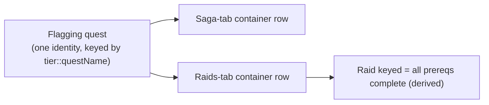
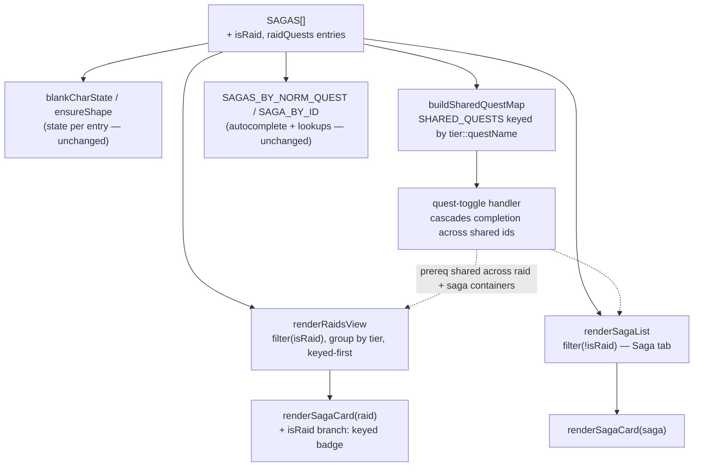

# Raids Tab - Plan

**Product Contract preservation:** changed — **R17** clarified. Planning found raids reuse the
existing per-quest completion state, so there is no new persisted field; the v14 → v15 bump is a
nominal content marker (mirrors v9), not a new-field migration. All other Product Contract text and
R/F/AE IDs are unchanged. Planning added Key Technical Decisions, High-Level Technical Design,
Implementation Units, a Verification Contract, Risks, and a Definition of Done below without
altering any product decision above.

## Goal Capsule

- **Objective:** Add a per-character **Raids** tab that tracks every permanent DDO raid,
  modeled and styled exactly like the Saga tab's content, with full live parity (LFM badges,
  header pill, autocomplete, roster location) and a derived "keyed" status.
- **Product authority:** User (project owner). All six scoping decisions below are user-directed.
- **Open blockers:** None block planning. Two items to settle during planning: the exact
  permanent-raid roster (harvest) and how raids missing formal prereq quests render their
  "keyed" state. See Outstanding Questions.

## Product Contract

### Summary

A new top-level **Raids** tab — placed before Patrons (order: Saga | Raids | Patrons | Filters) —
lists every permanent Heroic, Epic, and Legendary raid as a container under its tier header,
reusing the existing saga-content design. Each container holds the raid's flagging/prereq quests
plus the raid itself as checkable rows; "keyed" is derived from prereq completion. Raid containers
get the same live overlays saga containers have. A raid's flagging quests are treated as the same
quest wherever they appear, so the Raids and Saga tabs never disagree.

### Problem Frame

The tracker deliberately carved raids out of the existing containers — the Non-Saga Epic packs
list flagging chains like VoN 1–5 or the Demon Queen prep quests but explicitly exclude the raid
itself (`"raid VoN 6 / Plane of Night excluded"`, `"raid Zawabi's Revenge excluded"`). Raids are
therefore the one class of endgame content with no home in the app, even though they are the
hardest content to organize, flag, and fill a group for. The live raid-LFM corner panel shows
what is forming *right now* but offers no per-character record of what a character has flagged or
completed. This tab closes that gap.

### Key Decisions

- **Per-character tracker, not a read-only catalog.** (session-settled: user-directed — chosen
  over a Patrons-style derived read-only view: the value is recording each character's flagging
  and completion progress.) Introduces new persisted state and a schema bump to v15.
- **Model raids exactly like saga content.** (session-settled: user-directed — chosen over a
  compact keyed+completed two-checkbox row and over tier×keyed sub-grouped containers: reuse the
  tier-header → container → checkable-quest-row structure and its CSS wholesale.)
- **Track per-quest completion; derive "keyed."** (session-settled: user-directed — chosen over a
  manual keyed toggle and over independent keyed/completed checkboxes: in DDO, being keyed *is*
  having completed the raid's prerequisite quests, so keyed can be computed, mirroring the
  derived-favor pattern.)
- **Full live parity with sagas.** (session-settled: user-directed — chosen over tracker+wiki-only
  and over LFM-badges-only: raid containers get live LFM badges, the header live-LFM pill, and
  autocomplete, extending the existing DDO Audit live feed / LFM index.)
- **Coverage is all permanent raids only.** (session-settled: user-directed — chosen over
  including seasonal/event raids: bounded, stable data set across Heroic, Epic, and Legendary.)
- **Shared identity across tabs.** (session-settled: user-directed — chosen over independent
  per-container checkboxes and over reading prereq state read-only: a prereq quest is one quest
  everywhere it appears, wired through the existing same-tier `SHARED_QUESTS` cascade, so checking
  it in the Raids tab or the Saga tab reflects in both with no divergence and no double entry.)
- **Keyed-vs-not is a sort, not a sub-header.** (agent inference, accepted at synthesis.) Within
  each tier header, containers list keyed-required raids first, then no-key raids, each tagged with
  a keyed/no-key badge — matching "model like saga content" (flat container list under a tier
  header), not explicit "Requires Keying / No Key" sub-headers.
- **No reaper-seal tracking for raids in v1.** (agent inference.) The reaper seal (`sagaDone`) is a
  saga-reward concept; raids track quest completion and derived keyed only.

### Requirements

**Tab shell and placement**

- R1. A third top-level tab labeled **Raids** appears between Saga and Patrons; final visible order
  is Saga, Raids, Patrons, with the Filters tab last as today.
- R2. The tab bar follows the existing ARIA tablist pattern (arrow-key nav, `aria-selected`,
  `aria-controls`) and toggles only the central content region; the header, filters, and corner
  clusters persist on the Raids tab as they do on Patrons.
- R3. The Filters panel is dimmed and inert on the Raids tab, matching its treatment on the
  Patrons tab.

**Structure and layout**

- R4. Raids are grouped under tier headers (Heroic, Epic, Legendary) using the same tier-header
  treatment as the Saga tab.
- R5. Each raid is a container styled like a saga/non-saga container, holding its flagging/prereq
  quests plus the raid instance itself as checkable quest rows, with a container progress bar.
- R6. Within a tier, keyed-required raids sort before no-key raids; each container shows a
  keyed/no-key badge.

**Tracking and keyed status**

- R7. Each quest row (prereq and raid) is a per-character completion checkbox, persisted like saga
  quest completion.
- R8. A raid's "keyed" status is computed as all of its prerequisite quests being complete; raids
  with no prerequisites are always keyed.
- R9. The container reflects keyed status and completion of the raid instance visibly (badge and
  progress), without storing keyed as its own field.

**Cross-tab identity**

- R10. A flagging quest that also appears in a Saga-tab container is the same quest: completing it
  in either tab updates both, via the existing same-tier `SHARED_QUESTS` cascade.
- R11. No raid prereq produces a second independent checkbox for a quest already tracked in a Saga
  container.

**Live parity**

- R12. Raid containers show live LFM badges when a matching group is forming, sourced from the
  same live feed the raid corner panel uses.
- R13. The raid container header shows the live-LFM pill, matching the saga header treatment.
- R14. Raid quests participate in quest autocomplete and guild-roster location matching on the same
  terms as saga quests.

**Data and persistence**

- R15. Coverage is every permanent Heroic, Epic, and Legendary raid; seasonal/event raids are
  excluded.
- R16. Raid and prereq data (levels, region, pack, patron, flagging chain, wiki link) is
  wiki-sourced and never fabricated.
- R17. Raid content is additive: completion reuses the existing per-quest state
  (`progress[char][raidId].quests[questName]`), so no new persisted field is introduced. The change
  bumps `SCHEMA_VERSION` 14 → 15 as a content marker through `ensureShape()` without renaming or
  removing any field older builds wrote and without changing `STORAGE_KEY`; import/export round-trips
  losslessly, as it already does for any quest-completion value.

### Key Flows

- F1. **Flag and run a raid.** **Trigger:** player opens the Raids tab, expands a raid container.
  Checks off each prereq quest as completed; when all prereqs are checked the container flips to
  keyed. Checks the raid instance row when the raid is run. Progress bar and keyed badge update.
- F2. **Live group forming.** **Trigger:** an LFM for a raid the active character is level-relevant
  for appears in the feed. **Covers R12, R13.** The matching raid container shows the LFM badge and
  the header pill updates, identical to saga-container behavior.
- F3. **Cross-tab check.** **Trigger:** player checks a shared flagging quest (e.g. a VoN step) in
  the Saga tab. **Covers R10, R11.** The same quest shows complete in its Raids-tab container and
  contributes to that raid's keyed derivation, with no separate checkbox.

### Visualizations

Tab shell after the change:

```
[ 📜 Saga ]  [ ⚔ Raids ]  [ ⚜ Patrons ]        [ ⚙ Filters ]
                  ^ new, before Patrons
```

Raids-tab body structure:

```
── Heroic ───────────────────────────────
  ▸ [KEYED REQ]  Raid A            (2/5)
        prereq q1  ☐   prereq q2  ☑ ...  raid instance ☐
  ▸ [NO KEY]     Raid B            (0/1)
── Epic ─────────────────────────────────
  ▸ [KEYED REQ]  Raid C ...
```

Shared-identity cascade (why the two tabs never disagree):



### Acceptance Examples

- AE1. **Keyed derivation.** **Covers R8.** A raid with three prereq quests shows "not keyed" until
  all three rows are checked; checking the third flips it to keyed with no manual toggle.
- AE2. **No-prereq raid.** **Covers R8.** A raid with no flagging chain shows as keyed at all times;
  its only checkable row is the raid instance.
- AE3. **Shared quest, one identity.** **Covers R10, R11.** A VoN flagging step checked in the
  Non-Saga Epic Vault of Night container appears checked in the Raids-tab Vault of Night container,
  and vice versa; there is exactly one checkbox for that quest per character.
- AE4. **Dual appearance is expected.** **Covers R5, R10.** Demogorgon, already present in the Saga
  tab, also appears as a raid container; the shared flagging quests show consistent completion in
  both places rather than being deduplicated away.
- AE5. **Event raid absent.** **Covers R15.** A seasonal/event raid (e.g. Mabar's Killing Time) does
  not appear in the tab.

### Scope Boundaries

Deferred for later:

- Seasonal/event raids.
- Raid loot / named-item lists per raid.
- A raid lockout / "next available" loot-timer indicator — would require new per-character
  timestamp state and date handling beyond the completion-checkbox model.
- Reaper-seal tracking for raids.

### Dependencies / Assumptions

- Wiki harvest of the permanent-raid roster from ddowiki (Category:Raids), via same-origin
  MediaWiki API / Chrome MCP — direct `web_fetch` is proxy-blocked.
- Raid prereqs are same-tier as their raid, so the existing within-tier `SHARED_QUESTS` cascade
  (`sharedKey(tier, questName)`) is the correct identity mechanism without a cross-tier variant.
- The live raid-LFM plumbing already resolves raids against the DDO Audit reference cache
  (`sooksSagaScrollRef`), so live parity extends existing infrastructure rather than adding a feed.
- `DDO_REF_EPOCH` is currently **3**; adding raid quests/areas that a pre-existing cache lacks
  requires bumping it (→ 4) so stale caches refetch once. (An older README note saying "currently 2"
  is stale.)
- Schema is v14 today; this feature bumps it to v15.

### Outstanding Questions

Resolve before planning:

- None blocking.

Deferred to planning:

- The exact permanent-raid roster and each raid's flagging chain (harvest output).
- How a raid with an informal or non-quest flagging requirement (e.g. item collection) represents
  its prereqs and keyed derivation.
- Whether the raid instance itself should participate in the `SHARED_QUESTS` cascade or only its
  prereqs (raid instances were the excluded rows in existing containers, so likely no existing
  sibling — confirm during harvest).

### Sources / Research

- Container data model and the deliberate raid carve-out: `SAGAS` array, e.g. the Non-Saga Epic
  Vault of Night / Zawabi's Refuge entries with `"raid ... excluded"` notes.
- Completion keying: `state.progress[char][sagaId].quests[questName]`; per-life seal `sagaDone`.
- Cross-container quest identity: `SHARED_QUESTS` / `sharedKey(tier, questName)` /
  `buildSharedQuestMap()`.
- Tab shell: the `role="tablist"` nav (`tabSaga`/`tabPatrons`/`tabFilters`), `setActiveTab`,
  `bindTabBar`, `#sagaList` / `#patronsView`.
- Live raid plumbing: `renderRaidCorner`, `#raidCorner`, DDO Audit reference cache
  (`DDO_REF_KEY = "sooksSagaScrollRef"`, `DDO_REF_EPOCH = 3`, `DDO_REF_TTL`).

---

## Planning Contract

**Target file:** the single-file app (current build `sooks-saga-scroll-07272026-7.html`). Per the
project's copy-first park workflow, edits land on a **new** build file copied from the current one,
then `index.html` is synced for the Pages deploy — never edit a parked build in place.

**Depth:** Standard. Heavy reuse of established patterns (the v9 additive-tier precedent, the
Patrons two-tab precedent, `renderSagaCard`); the novel surface is the wiki harvest volume and the
shared-quest cascade blast radius into the existing Saga tab.

**Sequencing:** U1 (tab shell) and U2 (data model + seed) are independent and can land first; U3
(rendering) depends on both; U4 (full harvest) depends on U2's shape; U5 (live parity) depends on
U3; U6 (self-check) depends on U4. Build mechanics against a 2–3 raid seed set, then harvest the
full roster (U4) once the shape is proven.

---

## Key Technical Decisions

- **KTD1. Raids are additive `SAGAS` entries flagged `isRaid: true`, on their base tier**
  (Heroic / Epic / Legendary), not a separate data structure. (session-settled: user-approved —
  chosen over a standalone raid table: reuses `blankCharState`/`ensureShape` state creation,
  `buildSharedQuestMap` cascade, `SAGAS_BY_NORM_QUEST`/`SAGA_BY_ID` indexes, and `renderSagaCard`
  rendering; the exact precedent is the v9 Non-Saga tiers, documented as "purely additive.")
  Using the **base tier** (not a synthetic "Raid Epic" tier) is what lets the shared-quest cascade
  link a raid prereq to its Saga-tab twin, because `SHARED_QUESTS` is keyed by
  `sharedKey(tier, questName)`. Implements the shared-identity decision (R10, R11).
- **KTD2. No new persisted field; completion reuses `progress[char][raidId].quests[questName]`.**
  (session-settled: user-approved — chosen over a new keyed/completed state map: keyed is derived
  and completion reuses the existing per-quest map, whose `ensureShape` value-passthrough already
  round-trips unknown values losslessly.) `SCHEMA_VERSION` bumps 14 → 15 as a content marker only;
  `VALID_TIER_FILTERS` and `STORAGE_KEY` are untouched because raids reuse base tiers and never
  appear in the Saga tier filter. Refines R17.
- **KTD3. Keyed is derived at render only.** `raidKeyed(char, raid)` returns true when every prereq
  quest is complete; computed in `renderRaidsView`, never stored, never on the 15s live tick —
  mirroring `computeCharacterFavor`. Implements R8, R9.
- **KTD4. Each raid container marks its raid-instance quest(s) explicitly** via a new per-container
  field `raidQuests` (subset of `quests`). Keyed derivation = (`quests` − `raidQuests`) all
  complete. Prereqs stay in `quests` so they join the `SHARED_QUESTS` cascade like any other quest;
  the raid instance is typically a unique name (the row deliberately excluded from existing
  containers) and gets its own completion slot. Implements R5, R8.
- **KTD5. `renderRaidsView` reuses `renderSagaCard`** per raid container, with a small `isRaid`
  branch in `renderSagaCard` that swaps the saga-reward / banking / FTR affordances for a keyed
  badge + raid-instance completion. `renderSagaList` excludes `isRaid` containers with a one-line
  filter (`SAGAS.slice()` → `SAGAS.filter(s => !s.isRaid)`, ~line 15641). Implements R4–R6, R12–R14.
- **KTD6. Three-tab shell.** `setActiveTab` / `bindTabBar` extend to a third content panel
  `#raidsView`; visible order Saga | Raids | Patrons, Filters last. Filters dimmed/inert on Raids,
  matching Patrons. Implements R1–R3.
- **KTD7. `DDO_REF_EPOCH` bumps 3 → 4** so any pre-existing reference cache refetches once and picks
  up raid quest_ids / area_ids that autocomplete and LFM matching need but a stale cache lacks.
  Implements R14 (and keeps R12 honest for the new content). Follows the documented epoch-bump rule.

---

## High-Level Technical Design

The change is additive: one data flag (`isRaid`) fans out through machinery that already iterates
`SAGAS`. Only the two view functions branch on it.



The cascade edge is the load-bearing one: because a raid prereq shares `tier::questName` with its
Saga-tab twin, one toggle writes both containers' `quests[q]` — no divergence, no double entry.

---

## Implementation Units

### U1. Three-tab shell (Saga | Raids | Patrons | Filters)

- **Goal:** Add the Raids tab and an empty `#raidsView` panel that the tab bar toggles.
- **Requirements:** R1, R2, R3.
- **Dependencies:** none.
- **Files:** the build file — tab-bar markup (`nav.tab-bar`, ~line 4768), `#raidsView` panel next to
  `#sagaList`/`#patronsView` (~line 4774), `setActiveTab`/`bindTabBar`, and the `.tab-bar` / view
  CSS (~line 4462).
- **Approach:** Insert a `⚔ Raids` `role="tab"` button between `tabSaga` and `tabPatrons`
  (`aria-controls="raidsView"`). Add `<section id="raidsView" role="tabpanel" hidden>`. Extend
  `setActiveTab`/`bindTabBar` to include the raids tab in the arrow-key tablist and the
  show/hide/`aria-selected` toggling; dim + inert the Filters panel on the Raids tab exactly as on
  Patrons. Reserve-scrollbar and sweep-in CSS already generalize — add `#raidsView` to the same rules.
- **Patterns to follow:** the existing Patrons tab wiring (`tabPatrons`/`#patronsView`,
  Build 07272026.1 two-tab shell) is the direct template.
- **Test scenarios:** Covers R1 — clicking Raids shows `#raidsView`, hides `#sagaList`/`#patronsView`,
  sets `aria-selected`. Covers R2 — arrow keys cycle Saga↔Raids↔Patrons↔Filters; header and corner
  clusters persist across all tabs. Covers R3 — Filters is dimmed and non-interactive while Raids is
  active. Tab order reads Saga, Raids, Patrons, Filters left to right.
- **Verification:** all four tabs switch correctly; no console errors; centered content does not
  shift when switching to the short Raids panel (scrollbar gutter reserved).

### U2. Raid data model + schema v15 (seed set)

- **Goal:** Establish the `isRaid` / `raidQuests` container shape with a 2–3 raid seed set and mark
  the content bump, without leaking raids into the Saga tab.
- **Requirements:** R5, R16, R17.
- **Dependencies:** none.
- **Files:** the build file — the `SAGAS` array / `SAGAS.push(...)` block (~line 11959 / ~13300),
  `SCHEMA_VERSION` constant, `renderSagaList` filter (~line 15641), the v-history comment block
  (~line 12790).
- **Approach:** Add a seed set of raid containers (e.g. Vault of Night, Tempest's Spine) as `SAGAS`
  entries with `isRaid: true`, base `tier`, `quests` listing prereqs + the raid instance, and
  `raidQuests` naming the instance row(s). Bump `SCHEMA_VERSION` 14 → 15 with a v15 comment noting it
  is additive (raids reuse `quests[]`; no new field), mirroring the v9 note. Change
  `renderSagaList`'s `SAGAS.slice()` to `SAGAS.filter(s => !s.isRaid)` so raids never appear in the
  Saga tab or its tier filter. Confirm `blankCharState`/`ensureShape` create/preserve state for the
  new entries with no other change.
- **Patterns to follow:** the v9 Non-Saga additive-tier change; existing container object shape
  (`ns-e-vault-of-night` etc.).
- **Test scenarios:** Covers R5 — a seed raid container carries prereq rows + a raid-instance row and
  `raidQuests` names only the instance. Covers R17 — loading a pre-v15 save creates blank state for
  each raid container via `ensureShape` with no data loss; exporting then re-importing round-trips
  raid completion values byte-identically. Seed raids do **not** render in the Saga tab under any
  tier filter. `node --check` passes.
- **Verification:** Saga tab is visually unchanged; a v14 save loads clean and gains raid state; the
  `raidQuests` field is preserved through import/export.

### U3. Keyed derivation + raid-view rendering

- **Goal:** Render raid containers in `#raidsView`, grouped by tier and keyed-first, reusing
  `renderSagaCard` with an `isRaid` keyed-badge branch.
- **Requirements:** R4, R5, R6, R7, R8, R9.
- **Dependencies:** U1, U2.
- **Files:** the build file — new `renderRaidsView` + `raidKeyed` helpers (near `renderPatronsView`),
  `renderSagaCard` (`isRaid` branch), the tab-render dispatch that calls `renderPatronsView` on tab
  switch, and raid-view CSS (reuse `.tier-section`/`.saga`/keyed-badge styles).
- **Approach:** `raidKeyed(char, raid)` = every quest in `raid.quests` not in `raid.raidQuests` is
  complete (raids with empty prereqs are always keyed). `renderRaidsView` filters
  `SAGAS.filter(s => s.isRaid)`, groups under Heroic/Epic/Legendary tier headers (reuse the tier
  group-order pattern from `renderSagaList`), sorts keyed-required raids before no-key raids within a
  tier, and appends `renderSagaCard(raid)` per container. In `renderSagaCard`, branch on
  `saga.isRaid` to show a keyed / not-keyed badge + raid-instance completion instead of the saga
  reward / banking / FTR affordances. Wire the raids tab to call `renderRaidsView` on activation,
  matching how Patrons renders on its tab (not on `renderAll` / live tick).
- **Patterns to follow:** `renderPatronsView` (tab-scoped render), `computeCharacterFavor` (derived,
  render-only), the `renderSagaList` tier-group-order block (~line 15698), `renderSagaCard`.
- **Test scenarios:** Covers AE1 — a 3-prereq raid shows "not keyed" until the third prereq is
  checked, then keyed, with no manual toggle. Covers AE2 — a no-prereq raid shows keyed always; its
  only row is the raid instance. Covers R6 — within a tier, keyed-required raids sort before no-key
  raids; each shows a keyed/no-key badge. Covers R4 — raids group under correct tier headers. Keyed
  status recomputes when a prereq is toggled and the view re-renders. Reduced-motion respected.
- **Verification:** raid cards render with the saga-card look; keyed badge and progress update live on
  toggle; no reward/banking UI appears on a raid card; 0 console errors.

### U4. Full permanent-raid harvest

- **Goal:** Populate every permanent Heroic/Epic/Legendary raid with wiki-sourced data.
- **Requirements:** R15, R16.
- **Dependencies:** U2.
- **Files:** the build file — the `SAGAS.push(...)` raid block.
- **Approach:** Harvest the permanent-raid roster from ddowiki (Category:Raids) via the same-origin
  MediaWiki API / Chrome MCP (direct `web_fetch` is proxy-blocked). For each raid capture name,
  base tier, level, region, pack, patron, wiki link, the flagging/prereq quest chain, and the
  raid-instance quest(s) → `raidQuests`. Prefer prereq quest names that match existing container
  entries verbatim so the cascade links them (watch the comma-in-name parser gotcha noted in the
  wiki-audit method). Exclude seasonal/event raids.
- **Execution note:** harvest the full Category:Raids set — do not slice the source by a fixed char
  budget (the same gotcha that dropped 47 quests during the favor harvest); let U6's self-check flag
  any gap.
- **Patterns to follow:** the patron-favor harvest provenance workflow (`data/` reconciliation log);
  existing container data entries as the field template.
- **Test scenarios:** Covers R15 — every permanent raid present across the three tiers. `Covers AE5.`
  No event raid (e.g. Killing Time) appears in the tab. Covers R16 — each raid's prereq names, levels, and wiki links match
  the wiki; shared prereqs match existing container names exactly (spot-check VoN, Demon Queen,
  Demogorgon). `Covers AE4.` Demogorgon appears as a raid container and its shared quests reflect
  Saga-tab completion.
- **Verification:** raid count matches the wiki roster; a reconciliation note lands in `data/`.

### U5. Live parity + reference-cache epoch bump

- **Goal:** Confirm raid containers get live LFM badges, the header pill, and autocomplete, and force
  a one-time cache refetch for new raid content.
- **Requirements:** R12, R13, R14.
- **Dependencies:** U3.
- **Files:** the build file — `DDO_REF_EPOCH` constant (~line 14165), and verification against
  `refreshLfmIndex`/`_lfmIndex`, `renderSagaCard`'s LFM path, and the autocomplete resolver
  (`SAGAS_BY_NORM_QUEST`).
- **Approach:** Because raids are `SAGAS` entries rendered by `renderSagaCard`, LFM badges and the
  header pill attach with no code change — verify with a synthetic/live LFM. Bump `DDO_REF_EPOCH`
  3 → 4 with a comment noting the raid-content addition, so stale caches refetch once and gain raid
  quest_ids/area_ids. Confirm autocomplete resolves a raid quest to its raid container and that a
  shared prereq resolves consistently (cascade), without double-marking.
- **Patterns to follow:** `renderRaidCorner`'s existing raid↔DDO-Audit resolution; the documented
  `DDO_REF_EPOCH` bump rule for expansions/patches.
- **Test scenarios:** Covers R12/R13 — a synthetic LFM for a level-relevant raid shows the badge on
  the matching raid card and updates the header pill. Covers R14 — entering a raid quest instance
  autocompletes the raid-instance row; a shared prereq autocompletes and cascades to both tabs.
  A pre-epoch-4 cache refetches once on load.
- **Verification:** live badges appear on raid cards; autocomplete marks the correct row; stale cache
  busts exactly once.

### U6. Data self-check assertions

- **Goal:** Extend `runDataSelfCheck` to validate raid coverage and keyed/shared-identity integrity.
- **Requirements:** R8, R10, R11, R15.
- **Dependencies:** U4.
- **Files:** the build file — `runDataSelfCheck`.
- **Approach:** Add assertions: every `isRaid` container has ≥1 `raidQuests` entry, all `raidQuests`
  are a subset of `quests`; every raid prereq that also appears in a non-raid container resolves to a
  shared `SHARED_QUESTS` group (proves shared identity, no orphan double-tracking); the raid count is
  reported alongside the existing container/quest-slot counts. Keep favor + existing checks intact.
- **Patterns to follow:** the existing `runDataSelfCheck` favor-integrity + container/slot-count
  assertions.
- **Test scenarios:** Covers R10/R11 — a deliberately mistyped raid prereq name (no shared group)
  fails the self-check. Covers R8 — a raid with no `raidQuests` fails. Covers R15 — the reported raid
  count equals the harvested roster. `Covers AE3.` A shared prereq resolves to one identity across
  both tabs (no orphan double-tracking). Self-check runs with 0 errors on the real data.
- **Verification:** `runDataSelfCheck` reports 0 errors with the raid counts included; introducing a
  data defect trips the relevant assertion.

---

## Verification Contract

- `node --check` on the built file passes (JS syntax).
- `runDataSelfCheck()` reports 0 errors, with raid coverage + keyed/shared-identity assertions and
  the raid count included alongside the existing container/quest-slot/favor counts.
- Browser pass (localhost http server + Claude-in-Chrome, per the project's verification method):
  all four tabs switch; raid cards render with the saga-card look; keyed badge + progress update on
  toggle; 0 console errors.
- **Cross-tab cascade:** checking a shared raid prereq in the Raids tab reflects in its Saga-tab
  container and vice versa; exactly one checkbox exists per shared quest per character (R10, R11).
- **Schema safety:** a v14 export imports cleanly into the v15 build; a v15 export round-trips raid
  completion byte-identically (R17).
- **Live parity:** a synthetic/live LFM shows badges on raid cards; autocomplete marks the correct
  raid row; a pre-epoch-4 cache refetches once.

---

## Risks & Mitigations

- **Cascade blast radius.** Raid prereqs join the shared-quest map that also drives the Saga tab, so
  a data error (mismatched name, wrong tier) or a `renderSagaCard` `isRaid` regression could affect
  the Saga tab. Mitigation: U6's shared-identity assertion; keep the `isRaid` branch in
  `renderSagaCard` narrow and additive; verify the Saga tab is visually unchanged after U2.
- **Harvest accuracy / volume.** The permanent-raid roster and flagging chains are the bulk of the
  effort and are error-prone (name spelling must match existing entries for the cascade). Mitigation:
  full-set harvest (no char-budget slice), verbatim-name matching, U6 coverage assertion, `data/`
  reconciliation log.
- **Stale reference cache.** New raid content won't get live badges/autocomplete until caches carry
  its ids. Mitigation: `DDO_REF_EPOCH` 3 → 4 forces a one-time refetch.
- **Raid instance shared-name collision.** If a raid-instance quest name happens to collide with a
  quest in another container/tier, the cascade could link them unintentionally. Mitigation: U6 flags
  unexpected shared groups; treat any raid-instance appearing in a shared group as a data question.

---

## Definition of Done

- Raids tab present between Saga and Patrons; all permanent Heroic/Epic/Legendary raids render as
  containers grouped by tier, keyed-required first, with keyed/no-key badges.
- Keyed status derives correctly from prereq completion; raid completion tracks per character.
- Shared raid prereqs are one identity across the Raids and Saga tabs (cascade verified both ways).
- Live LFM badges, header pill, and autocomplete work on raid cards; `DDO_REF_EPOCH` bumped.
- `SCHEMA_VERSION` at 15; v14 saves migrate cleanly; import/export round-trips losslessly.
- `node --check`, `runDataSelfCheck` (0 errors, raid assertions included), and the browser pass all
  green; build parked per the copy-first retention workflow and `README.md` updated.
